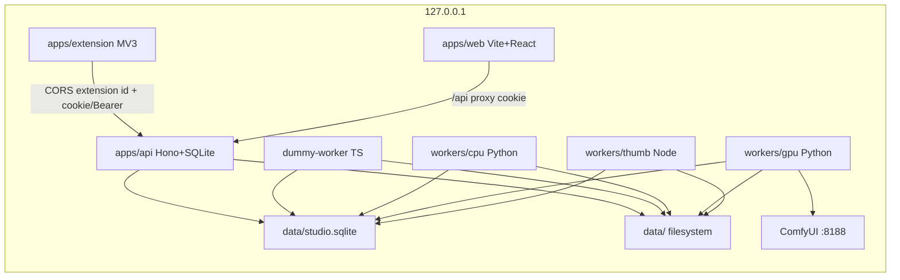
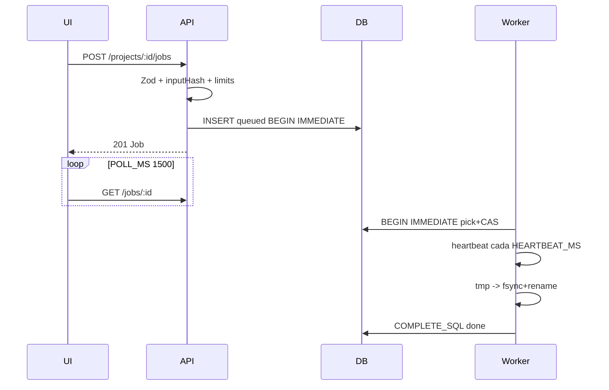
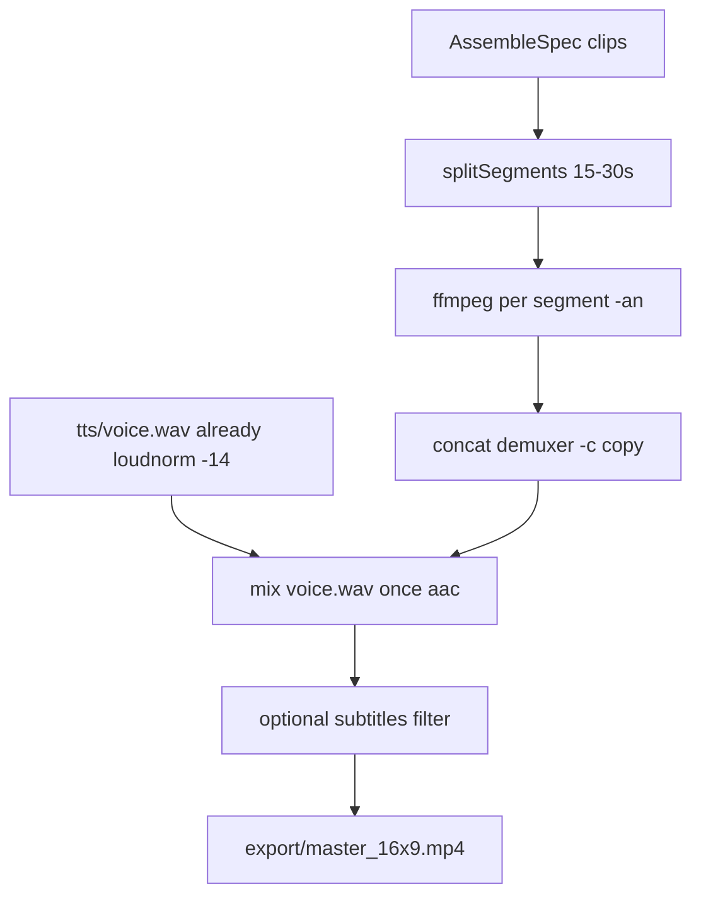

# Pack de implementacion v1 — faceless-production-suite

| Campo | Valor |
|---|---|
| Titulo | Pack de implementacion v1 (E0b–E10) |
| Autor | Arquitecto (spec pack) |
| Fecha | 2026-09-19 |
| Status | Approved (review 3 rounds, 0 open issues) |
| Repo | `C:\Users\jose\faceless-production-suite` |
| GitHub | https://github.com/Joereload2/faceless-production-suite |
| HEAD base | `7d248d4` (`main`) — P0 ya aterrizado |
| Destino final | `docs/implement/` (este pack es canonico para el codigo restante) |
| Audiencia | Modelo de codigo barato: cero decisiones de producto/arquitectura |

Este documento **no reabre** `docs/plan/01-decisiones-cerradas.md`. Cierra huecos que Claude dejo abiertos con una sola opcion ejecutable. Donde este pack y el doc 03 discrepan (aprobaciones, `script`/`thumb` inputs, SQL FIFO), **gana este pack** y el PR que toque el schema actualiza `docs/plan/03-contratos-datos-variables.md` en el mismo PR.

P0 ya existe. No se re-especifica como si faltara: lease 30s vs `deadline_at`, CAS `RETURNING`, indice GPU, `cancel_requested`, `input_hash`, `data/*` gitignored, pnpm+Vitest+GHA, 8 tests de contrato, roadmap E0b/E3b/E7b, `contract.json`.

---

## Overview

El estudio local (propuesta A) debe producir un `master_16x9.mp4` reproducible, con dos puertas humanas (guion; master+thumb), sin cloud, sin segundo orquestador y sin que el dashboard ejecute ffmpeg/Comfy. Hoy el repo es contrato + docs. Falta todo el runtime desde E0b.

Este pack congela archivos, tipos Zod, SQL, HTTP JSON, argv de Piper/ffmpeg, CLI, tests y Definition of Done por etapa. Un implementador ejecuta **un ticket por sesion**, sin inventar modulos, timeouts, auth ni formato de aprobacion.

---

## Background & Motivation

P0 cerro el contrato Job (lease corto, deadline fijo, sweeper, GPU lock). El analisis Claude (`D:\Descargas\analisis-faceless-production-suite.md`) senalo huecos que todavia no son codigo: token en el bundle SPA, aprobaciones booleanas, claim FIFO, `AssembleSpec` vs segmentos, modulos `script`/`thumb` ausentes en `ModuleInput`, dummy worker, kill de procesos en Windows, JSON canonico, spike de riesgo (E0b) antes de la cola.

El ecosistema viejo (YouToMagic, VisuaLibrary, FacelessCreator, VigilCut, `package.yaml` 0.1) esta abandonado. No se especifica ni se cita como fuente de tipos.

Dolor actual: un coding agent que lea solo `docs/plan/*` todavia tiene que decidir auth, SQL de cola, estilo de captions, voz Piper, modelo Claude y como matar ffmpeg en Windows. Eso produce drift. Este pack elimina esas decisiones.

---

## Goals & Non-Goals

### Goals

- Especificar E0b–E10 al nivel de archivos, SQL, JSON, argv y tests.
- Primer MP4 local (`data/projects/<id>/export/master_16x9.mp4`) en E7; spike de fixture en E0b.
- Contrato Job unico en `packages/schema` → `contract.json` → Python.
- Dashboard observador. Workers ejecutan. API valida y persiste.
- Windows (PowerShell) como maquina owner.

### Non-Goals (v1, no hay ticket)

- Cloud jobs (`CLOUD_JOBS=1`), Wan, K8s, Electron, LangGraph, n8n, segundo orquestador.
- SSE / websockets (polling `LIMITS.POLL_MS` hasta despues del primer MP4).
- YouTube Data API upload. Tool `youtube.publish`.
- Unsplash (interfaz en schema; cero PRs v1).
- Postgres, S3, Next, bind `0.0.0.0`.
- k-factors de timeout (solo medicion en E0b; subir bases en PR dedicado de schema).
- ElevenLabs / cloud TTS.
- Editor visual de timeline.
- Copiar FacelessCreator / VigilCut EDL.

---

## Key Decisions

Cada fila es **cerrada**. No reabrir en un ticket de codigo.

| ID | Decision | Rationale |
|---|---|---|
| K1 | Estudio local (A). Primer MP4 en disco. | `01` A1. |
| K2 | Job como si `engine=cloud` existiera, pero `CLOUD_JOBS=0` y 403 si `engine=cloud`. | `01` A2 C2. |
| K3 | Auth SPA = **cookie HttpOnly** `studio_token` (HMAC-SHA256 estatico del token, no tabla de sesiones). Bearer solo para curl/scripts. Cero `VITE_STUDIO_TOKEN`. Vite proxy `/api` en dev; same-origin en prod. Abrir **solo** `http://127.0.0.1:5173` (nunca `localhost`). | Evita token en JS (Claude analisis 18-sep, **no** el A7 de 01). CSRF via `SameSite=Strict` + Origin. |
| K4 | Fail-fast si `STUDIO_TOKEN` vacio o `length < 32`. | Claude analisis 18-sep. |
| K5 | Host/Origin allowlist **solo** `127.0.0.1` (puertos 8787 y 5173). CORS **solo** `chrome-extension://$EXTENSION_ID`. Cero `localhost` en allowlist. | Claude analisis 18-sep. |
| K6 | Aprobaciones ligadas a artefacto: `approved_*_job_id` + `approved_*_hash` + `approved_*_at`. Sin booleanos sueltos. Nuevo `assemble` borra master approval. | Claude analisis 18-sep, **no** el A8 de 01 (A8 01 = ffmpeg por segmentos, intacto). |
| K7 | Claim = `BEGIN IMMEDIATE` + `CLAIM_PICK` (FIFO + prioridad de modulo) + `CLAIM_BY_ID_SQL` CAS. | `01` A4 (claim atomico de fila). `CLAIM_SQL` deja de ser alias mudo. |
| K8 | `timeoutSec = MODULE_TIMEOUT_SEC[module]` al crear. Sin k-factor hasta medir en E0b. | Limites numericos de 01 / `packages/schema/job.ts`. |
| K9 | Audio mezclado **una vez al final**. Segmentos de video sin audio (`-an`). | `01` A8 (ffmpeg por segmentos) + doc 03. |
| K10 | Captions burn: filtro `subtitles`, Arial 24, `Alignment=2`, `MarginV=48`, outline 2, blanco. | Un estilo, cero UI. |
| K11 | Algoritmo de segmentos 15–30 s puede partir un clip. | `01` A8. Formula congelada abajo. |
| K12 | Dummy worker = TypeScript en `apps/api`. Default `DUMMY_MODULES=""` (lista vacia) → **no reclama ningun modulo**, solo sleep. Cada test/smoke que use dummy setea el CSV explicitamente. | Evita que un dummy vivo robe `tts`/`assemble` a Python/Node. |
| K13 | `PIPER_VOICE` es **siempre** path de filesystem al `.onnx` (vacio = `DATA_DIR/voices/{channel.piperVoice}.onnx`). El **id** de voz vive solo en `channel.json` (`en_US-lessac-medium`). Falta archivo → `errorCode=config` `"piper voice missing"`. | Un significado. `.onnx` fuera de git. Binario `OHF-Voice/piper1-gpl`. |
| K14 | E4 = Pexels only. Unsplash: tipo `source` rechazado con `validation` "source not in v1". | Roadmap. |
| K15 | E10 = checklist UI + abrir YouTube Studio / upload oficial. Cero Data API. | P2. |
| K16 | Kill Windows = `CREATE_NEW_PROCESS_GROUP` al spawn + `taskkill /F /T /PID` (argv list) al timeout/cancel. | Python 3.11, sin pywin32. |
| K17 | JSON canonico: UTF-8, keys ordenadas recursive, `separators=(',', ':')`, SHA-256 hex lowercase. TS y Python mismos fixtures. | Claude analisis 18-sep, **no** el A9 de 01 (A9 01 = polling `POLL_MS`, intacto). |
| K18 | Logs JSON `{level, ts, jobId, projectId, module, event}`. Nunca script, prompt completo, ni secretos. | S1, area backend. |
| K19 | Modulos `script` y `thumb` entran al Zod de E1 (dummy puede completarlos). Workers reales en E3b y E7b. | M1. |
| K20 | Modelo Claude: env `ANTHROPIC_MODEL` default **`claude-sonnet-5`** (default documentado Anthropic 2026-09). | Barato/rapido para guion; override por env. |
| K21 | Canal piloto `demo`, idioma `en`. Tone file `channels/demo/tone.md`. | Un canal, un tono, una voz. |
| K22 | Thumb worker = proceso Node `workers/thumb` (Sharp). CPU Python no usa Sharp. | Stack cerrado Sharp+SVG. |
| K23 | API Hono rutas **sin** prefijo interno (`/health`, `/projects`). SPA llama `/api/*` via proxy que recorta `/api`. Extension usa `API_BASE=http://127.0.0.1:8787` **sin** `/api`. Prod monta el mismo router en `/api` y sirve `WEB_DIST` (`apps/web/dist`) en `/`. | same-origin SPA; extension distinta. |
| K24 | Drizzle + `node:sqlite` (`DatabaseSync`). Mismo motor que `job.test.ts`. Sin better-sqlite3. | Menos nativos en Windows. |
| K25 | IDs = ULID (`ulid` npm, Crockford). HTTP y SQL en camelCase vs snake_case solo traducido por Drizzle. | doc 03. |
| K26 | Zod **strict** en fronteras. Extra keys = 400 `validation`. Client no envia `timeoutSec`. | |
| K27 | Prioridad claim **CPU** (loop Python): `script, tts, captions, assemble, stock, seo`. GPU: `image, video`. Thumb **no** esta en el loop CPU (K22, proceso Node aparte). | Un consumer por clase de worker. |
| K28 | E0b **no** usa cola ni Whisper. Fixture SRT. Spike en `workers/cpu/spike/`. Promover helpers en E7; `run_spike.py` queda como CLI operador. | M2. |
| K29 | `pnpm-workspace.yaml` = `packages/*` + `apps/*`. Python no es paquete pnpm. **E0b y E1a ambos** quitan el glob `workers/*` (diff idempotente). E7b anade `workers/thumb` (tiene `package.json`). | Si E0b crea `workers/cpu` sin quitar el glob, `pnpm install` rompe. |
| K30 | Originality checklist puerta 1: tres booleanos obligatorios `true`. | Claude M4. |
| K31 | Serve bind `127.0.0.1` en API, Vite, Comfy, cualquier HTTP worker. | A6. |
| K32 | LICENSE MIT en E1 (higiene C7). | |
| K33 | Compat VigilCut EDL: no. `AssembleSpec` es el formato. | Non-goal. |
| K34 | Fototeca / Unsplash: fuera de PRs v1 (`source not in v1`). **01 A7 (stock Pexels+Unsplash+fototeca) no se reabre**; el contrato `source` enum se conserva. v1 HTTP rechaza no-pexels como ya dice el roadmap 02. | Recorte 02, no un rewrite de 01-A7. |
| K35 | GPU worker = **proceso loop** (`workers/gpu/src/loop.py`) + httpx a `COMFY_URL`. Cero FastAPI, cero uvicorn, cero segundo HTTP de estudio. | 01 no nombra FastAPI. README/04/02 se parchean en E6. |
| K36 | E9 v1 = slideshow de stills image-v1 (`seconds*8` frames, max 40, fps 8) + ffmpeg. CI = lavfi color mp4, **sin Comfy**. Smoke Comfy video = skip-until-measured (mismo protocolo que E0b). | 40× image-v1 no cabe en 900 s de forma fiable. |
| K37 | `GET /jobs/:id/files/:name` resuelve `output.files[].path` **relativo a la raiz del proyecto** (no a `<module>/<jobId>/`). Sirve `export/master_16x9.mp4` y thumbs. | Un solo contrato de descarga. |
| K38 | `bytes_used` se incrementa en COMPLETE (`ADD_BYTES_SQL`). Error/cancel no suman. Sweeper reconcilia `SUM(bytes_out)`. | El cap 20 GiB deja de ser codigo muerto. |
| K39 | `ErrorCode` incluye `unauthorized`. 401 de auth usa ese codigo (no `config`). Cookie y Bearer se comparan con `timingSafeEqual`. | Distinguir login malo vs Piper missing. |
| K40 | `LIMITS` en `job.ts` incluye `IMPRESSION_FLOOR=1000`, `SEO_CTR_GAP=0.02`, `SEO_ROW_LIMIT=200`, `SEO_CLAUDE_ROWS=40`, `SCRIPT_MAX_TOKENS=4096`. | AGENTS.md: numeros solo en schema. |

---

## 1. Constitucion del implementador (texto para `AGENTS.md`)

Copiar este capitulo **literal** a `AGENTS.md` en el PR E1a. No resumir.

```markdown
# AGENTS.md

Eres un agente de codigo en `faceless-production-suite`.
No tomas decisiones de producto ni de arquitectura. Ejecutas un ticket de
`docs/implement/` (pack v1). Si el ticket no cabe, PARAS y preguntas.

## Orden de lectura (obligatorio, en este orden)

1. `AGENTS.md` (este archivo)
2. `docs/plan/01-decisiones-cerradas.md` — no reabrir
3. El ticket EX que te asignaron
4. `packages/schema/job.ts` + `packages/schema/inputs.ts` + `contract.json`
5. `docs/plan/03-contratos-datos-variables.md` si tocas persistencia
6. `docs/areas/<tu-area>.md`
7. `docs/plan/04-metodo-de-codigo.md`

No leas FacelessCreator, YouToMagic, VisuaLibrary, VigilCut ni `package.yaml`.
Ese ecosistema esta abandonado.

## Nunca

- Reabrir una fila de `01-decisiones-cerradas.md` o `Key Decisions` del pack.
- Inventar un modulo Job sin `packages/schema` + doc 03 **en el mismo PR**.
- Copiar numeros (`LIMITS`, timeouts, SQL) fuera de `@faceless/schema` / `contract.json`.
- Poner secretos en `Job.input`, logs, SQLite, fixtures o `VITE_*`.
- Bind `0.0.0.0`. `CLOUD_JOBS=1`. Electron, LangGraph, n8n, K8s, Wan. FastAPI/uvicorn en workers.
- `child_process` / `subprocess` con string de shell. Siempre argv list.
- Disparar jobs desde `useEffect` de mount.
- Segundo orquestador. El dummy worker usa el mismo SQL de claim.
- Commitear `.onnx`, `.safetensors`, `data/**` (salvo `.gitkeep`), `.env`.
- Tocar un archivo que el ticket no liste (salvo el test que el ticket pide).
- "Mejorar" el alcance del ticket.

## Layout

- `apps/api` Hono + Drizzle + SQLite + dummy-worker TS
- `apps/web` Vite + React 18 (observa, no orquesta)
- `apps/extension` MV3
- `packages/schema` unico sitio de numeros y Zod de inputs
- `workers/cpu` Python 3.11 (Piper, whisper, ffmpeg, stock, seo, script)
- `workers/gpu` Python 3.11 loop + httpx a Comfy (cero FastAPI/uvicorn)
- `workers/thumb` Node Sharp (desde E7b)
- `presets/` workflows Comfy sin pesos
- `channels/demo/` tono + channel.json
- `data/` gitignored
- `docs/implement/` este pack

## Como correr tests (Windows PowerShell, raiz del repo)

```powershell
pnpm install
pnpm -r typecheck
pnpm -r test
pnpm --filter @faceless/schema build:contract
git diff --exit-code -- packages/schema/contract.json
```

Python (desde E3, en `workers/cpu`):

```powershell
.\.venv\Scripts\python -m pytest -q
```

## Que significa Done

1. Typecheck del paquete tocado.
2. Tests del ticket (IDs listados) en verde.
3. Cero orquestador nuevo.
4. Cero secretos viajando.
5. Si tocaste Job/LIMITS/SQL: `packages/schema` + `docs/plan/03-contratos-datos-variables.md` + `contract.json` regenerado en el mismo PR.
6. Checklist DoD del ticket, item a item.

## Windows

- Rutas con `path.join` / `pathlib.Path`. Nunca interpolar `\` en un filtergraph a mano sin el helper de escape.
- Spawn: argv array. Kill: `taskkill /F /T /PID` (ver pack seccion 2.11).
- PowerShell no acepta `&&` en este entorno de agente: comandos separados o `;`.

## Una sesion = un ticket

Si el ticket es ambiguo, STOP. No "inferir". El pack no deberia ser ambiguo.
```

---

## 2. Huecos cerrados (picks concretos)

### 2.1 Auth — cookie HttpOnly `studio_token` + Bearer para CLI

La SPA **nunca** ve `STUDIO_TOKEN`. No es una sesion con tabla: el valor de la cookie es un HMAC estatico del token (cookie de token).

Boot (`apps/api/src/config.ts`):

```ts
STUDIO_TOKEN: z.string().min(32, "STUDIO_TOKEN required, min 32 chars"),
WEB_DIST: z.string().optional().default(""),
```

Si `STUDIO_TOKEN` falla: `console.error` JSON log `event=config_invalid` y `process.exit(1)`.

Helpers (mismo archivo `auth.ts`):

```ts
const TOKEN_COOKIE = "studio_token";
const TOKEN_MSG = "faceless.token.v1";

function hmacToken(secret: string): Buffer {
  return createHmac("sha256", secret).update(TOKEN_MSG).digest(); // 32 bytes
}

function timingSafeHexEqual(hex: string, expected: Buffer): boolean {
  try {
    const got = Buffer.from(hex, "hex");
    if (got.length !== expected.length) return false;
    return timingSafeEqual(got, expected);
  } catch {
    return false;
  }
}
```

Cookie:

| Campo | Valor |
|---|---|
| Name | `studio_token` |
| Value | hex de `hmacToken(STUDIO_TOKEN)` (64 chars) |
| Flags | `HttpOnly; SameSite=Strict; Path=/; Max-Age=604800` |
| Secure | **no** (http://127.0.0.1) |
| Domain | omitido |

Login `POST /auth/login` body `{ "token": "..." }`:

1. Si `token.length < 32` → 400 `validation`.
2. `timingSafeEqual(hmacToken(body.token), hmacToken(STUDIO_TOKEN))`.
3. Set-Cookie hex de `hmacToken(STUDIO_TOKEN)` (no el token del usuario).
4. 204 vacio.

Logout `POST /auth/logout`: **siempre 204**, con o sin cookie. `Set-Cookie: studio_token=; Max-Age=0; Path=/; HttpOnly; SameSite=Strict`.

`GET /auth/me`: 200 `{ "ok": true }` o 401 `{ "errorCode": "unauthorized", "message": "unauthorized" }`.

Middleware skip (sin cookie/Bearer): `GET /health`, `POST /auth/login`, `POST /auth/logout`. Host allowlist **si** se aplica a las tres.

En rutas no-skip:

1. Validar `Host` ∈ allowlist. Si no: 400 `{ "errorCode": "validation", "message": "bad host" }`.
2. Si method ≠ GET/HEAD: validar `Origin` ∈ allowlist. Si falta Origin: permitir **solo** si hay `Authorization: Bearer` valido (curl).
3. Auth: cookie `studio_token` via `timingSafeHexEqual` **OR** Bearer via `timingSafeEqual` de los HMAC (no `===` del token en claro).
4. Si no: 401 `{ "errorCode": "unauthorized", "message": "unauthorized" }`.

`POST /auth/logout` (skip auth): Host check; **siempre 204**; `Set-Cookie: studio_token=; Max-Age=0; Path=/; HttpOnly; SameSite=Strict`. No exige Origin ni cookie.

Allowlist Host (puerto de `STUDIO_PORT`, default 8787). **Solo loopback numerico:**

```
127.0.0.1:8787
127.0.0.1:5173
```

Allowlist Origin:

```
http://127.0.0.1:8787
http://127.0.0.1:5173
chrome-extension://${EXTENSION_ID}   // solo si EXTENSION_ID.length > 0
```

**Nunca** incluir `localhost`. UI y README: "abre siempre `http://127.0.0.1:5173`, nunca localhost".

CORS: responder `Access-Control-Allow-Origin` **solo** si Origin es exactamente `chrome-extension://$EXTENSION_ID`. `Allow-Credentials: true`. `Allow-Headers: Authorization, Content-Type`. `Allow-Methods: GET, POST, OPTIONS`. SPA no usa CORS (proxy same-origin).

Vite (`apps/web/vite.config.ts`):

```ts
server: {
  host: "127.0.0.1",
  port: 5173,
  proxy: {
    "/api": {
      target: "http://127.0.0.1:8787",
      changeOrigin: true,
      rewrite: (p) => p.replace(/^\/api/, ""),
    },
  },
},
```

SPA: `fetch("/api/...", { credentials: "include" })`. Cero headers Authorization. Cero `import.meta.env.VITE_STUDIO_TOKEN`.

Prod (E2): Hono `app.route("/api", api)` + `serveStatic` de `apps/web/dist` en `/`. Cookie Path=/ cubre ambos.

### 2.2 Aprobaciones ligadas a artefacto

Tabla `projects` **no** tiene `approved_script INTEGER`. Columnas:

```
approved_script_job_id TEXT
approved_script_hash   TEXT
approved_script_at     TEXT
approved_master_job_id TEXT
approved_master_hash   TEXT
approved_master_at     TEXT
approved_thumb_job_id  TEXT
approved_thumb_hash    TEXT
approved_thumb_at      TEXT
originality_checklist_json TEXT
publish_checklist_json TEXT
```

Hash = SHA-256 hex del archivo de artefacto (bytes del fichero, no JSON canonico del input):

- script → `script.json` bytes
- master → `export/master_16x9.mp4` bytes
- thumb → `export/thumb.png` bytes

`POST /projects/:id/jobs` con `module=assemble` que **inserta** un job nuevo (no replay idempotente) ejecuta:

```sql
UPDATE projects SET
  approved_master_job_id = NULL,
  approved_master_hash = NULL,
  approved_master_at = NULL,
  updated_at = ?
WHERE id = ?
```

Nuevo job `thumb` **no** borra master. Nuevo job `script` **no** borra la aprobacion vieja (el humano sigue teniendo un guion aprobado hasta que apruebe otro). Aprobar un script nuevo **reemplaza** las tres columnas script.

Publish (E10) habilita el boton solo si las tres tripletas estan no-nulas y los hashes coinciden con los archivos actuales en disco. Si el master se regenero, hash no coincide → boton off.

### 2.3 Claim FIFO — SQL exacto y helpers

`packages/schema/job.ts` (ticket **E1a**, mismo PR que doc 03):

Anadir a `ErrorCode`: `"unauthorized"`.

Anadir a `LIMITS`:

```ts
IMPRESSION_FLOOR: 1000,
SEO_CTR_GAP: 0.02,
SEO_ROW_LIMIT: 200,
SEO_CLAUDE_ROWS: 40,
SCRIPT_MAX_TOKENS: 4096,
```

Reescribir heartbeat/sweep a placeholders `?` **unicos** (borrar las variantes `:now` / named). Textos congelados:

```ts
export const HEARTBEAT_SQL = `UPDATE jobs
   SET updated_at = ?, lease_until = ?
 WHERE id = ? AND status = 'running' AND claimed_by = ?
RETURNING cancel_requested`;

export const SWEEP_STALE_SQL = `UPDATE jobs
   SET status = 'error', error_code = 'stale',
       error = 'lease expired', updated_at = ?
 WHERE status = 'running' AND lease_until < ?`;

export const SWEEP_TIMEOUT_SQL = `UPDATE jobs
   SET status = 'error', error_code = 'timeout',
       error = 'deadline exceeded', updated_at = ?
 WHERE status = 'running' AND deadline_at < ?`;
```

Sweeper: `stmtStale.run(now, now)` y `stmtTimeout.run(now, now)` (dos placeholders cada uno). Heartbeat: `stmt.get(now, lease, id, owner)`.

```ts
export const MODULE_CLAIM_ORDER: readonly Module[] = [
  "script", "tts", "captions", "assemble", "stock", "seo", "thumb", "image", "video",
] as const;

export function claimPickSql(modules: readonly Module[]): string {
  const allowed = new Set<string>(Object.keys(MODULE_TIMEOUT_SEC));
  for (const m of modules) {
    if (!allowed.has(m)) throw new Error(`invalid module: ${m}`);
  }
  const inList = modules.map((m) => `'${m}'`).join(", ");
  const cases = MODULE_CLAIM_ORDER.map((m, i) => `WHEN '${m}' THEN ${i + 1}`).join(" ");
  return `SELECT id FROM jobs WHERE status = 'queued' AND module IN (${inList}) ORDER BY CASE module ${cases} ELSE 99 END, created_at ASC, id ASC LIMIT 1`;
}
```

`CLAIM_BY_ID_SQL` ya existe (no cambiar el texto). Dejar de exportar `CLAIM_SQL = CLAIM_BY_ID_SQL` (deprecated comment: usar `claimPickSql` + `CLAIM_BY_ID_SQL`). Actualizar tests que lean `contract.sql.claimById`.

SQL de terminal + bytes (mismo `job.ts`):

```ts
export const COMPLETE_SQL = `UPDATE jobs
   SET status = 'done', progress = 1, output_json = ?, bytes_out = ?,
       updated_at = ?, claimed_by = NULL, lease_until = NULL
 WHERE id = ? AND status = 'running' AND claimed_by = ?
RETURNING id`;

export const FAIL_SQL = `UPDATE jobs
   SET status = 'error', error_code = ?, error = ?,
       updated_at = ?, claimed_by = NULL, lease_until = NULL
 WHERE id = ? AND status = 'running' AND claimed_by = ?
RETURNING id`;

export const CANCEL_RUNNING_SQL = `UPDATE jobs
   SET status = 'canceled', error_code = 'canceled', error = 'canceled',
       updated_at = ?, claimed_by = NULL, lease_until = NULL,
       cancel_requested = 1
 WHERE id = ? AND status = 'running' AND claimed_by = ?
RETURNING id`;

export const ADD_BYTES_SQL = `UPDATE projects
   SET bytes_used = bytes_used + ?, updated_at = ?
 WHERE id = ?`;

export const RECONCILE_BYTES_SQL = `UPDATE projects
   SET bytes_used = (
     SELECT COALESCE(SUM(bytes_out), 0) FROM jobs
      WHERE jobs.project_id = projects.id AND jobs.bytes_out IS NOT NULL
   )`;
```

`export-contract.ts` objeto **completo** (este es el unico literal; Python no inventa UPDATE):

```ts
const contract = {
  version: 1,
  modules: MODULE_TIMEOUT_SEC,
  gpuModules: GPU_MODULES,
  limits: LIMITS,
  errorCodes: [
    "timeout", "stale", "budget", "validation", "io", "config",
    "canceled", "internal", "idempotency_conflict", "unauthorized",
  ],
  pragmas: SQLITE_PRAGMAS,
  claimOrder: MODULE_CLAIM_ORDER,
  sql: {
    claimById: CLAIM_BY_ID_SQL,
    heartbeat: HEARTBEAT_SQL,
    sweepStale: SWEEP_STALE_SQL,
    sweepTimeout: SWEEP_TIMEOUT_SQL,
    oneGpuRunning: GPU_ONE_RUNNING_SQL,
    complete: COMPLETE_SQL,
    fail: FAIL_SQL,
    cancelRunning: CANCEL_RUNNING_SQL,
    addBytes: ADD_BYTES_SQL,
    reconcileBytes: RECONCILE_BYTES_SQL,
  },
};
```

Test E1a: `expect(contract.sql.complete).toContain("RETURNING")` y `expect(contract.sql.heartbeat).not.toContain(":now")`.

Helper TS **verbatim** (`apps/api/src/jobs/claim.ts`). E7b copia este bloque sin cambiar firmas:

```ts
export function claimOldest(
  db: DatabaseSync,
  modules: readonly Module[],
  owner: string,
  nowMs: number,
): Record<string, unknown> | null {
  db.exec("BEGIN IMMEDIATE");
  try {
    const pick = db.prepare(claimPickSql(modules)).get() as { id: string } | undefined;
    if (!pick) {
      db.exec("COMMIT");
      return null;
    }
    const timeoutRow = db
      .prepare("SELECT timeout_sec AS timeoutSec FROM jobs WHERE id = ?")
      .get(pick.id) as { timeoutSec: number };
    const now = utcIso(nowMs);
    const lease = leaseUntilIso(nowMs);
    const deadline = deadlineAtIso(nowMs, timeoutRow.timeoutSec);
    let claimed: Record<string, unknown> | undefined;
    try {
      claimed = db
        .prepare(CLAIM_BY_ID_SQL)
        .get(owner, now, lease, deadline, pick.id) as Record<string, unknown> | undefined;
    } catch (e) {
      const msg = e instanceof Error ? e.message : "";
      if (msg.toLowerCase().includes("unique") || msg.toLowerCase().includes("constraint")) {
        db.exec("ROLLBACK");
        return null;
      }
      throw e;
    }
    if (!claimed) {
      db.exec("COMMIT");
      return null;
    }
    db.exec("COMMIT");
    return claimed;
  } catch (e) {
    try { db.exec("ROLLBACK"); } catch { /* ignore */ }
    throw e;
  }
}

export function completeJob(
  db: DatabaseSync,
  jobId: string,
  projectId: string,
  owner: string,
  outputJson: string,
  bytesOut: number,
  nowIso: string,
): void {
  db.exec("BEGIN IMMEDIATE");
  const row = db.prepare(COMPLETE_SQL).get(outputJson, bytesOut, nowIso, jobId, owner);
  if (!row) {
    db.exec("ROLLBACK");
    throw new Error("complete missed");
  }
  db.prepare(ADD_BYTES_SQL).run(bytesOut, nowIso, projectId);
  db.exec("COMMIT");
}
```

Python (`workers/cpu/src/claim.py`) misma secuencia. SQL desde `contract.json`: `COMPLETE_SQL = contract["sql"]["complete"]`, `FAIL_SQL = contract["sql"]["fail"]`, etc. Ruta: env `CONTRACT_JSON` o `Path(__file__).resolve().parents[3] / "packages/schema/contract.json"`.

Sweeper (E1b) ademas ejecuta `RECONCILE_BYTES_SQL` cada tick (sin params). Error/cancel **no** llaman `ADD_BYTES_SQL`.

`claimOrder` se lee de JSON; Python construye el SELECT igual (IN list desde el argumento `modules`, CASE desde `claimOrder`).

Owner strings:

- dummy: `dummy-ts`
- cpu: `cpu-<hostname>`
- gpu: `gpu-<hostname>`
- thumb: `thumb-ts`

### 2.4 Timeout formula

Al `POST /projects/:id/jobs`:

```
timeoutSec = defaultTimeout(module)  // MODULE_TIMEOUT_SEC[module]
```

El client **no** envia `timeoutSec`. Si lo envia, Zod `.strict()` → 400.

E0b mide hardware y **puede** subir las bases en un PR **solo de schema** (`job.ts` + `contract.json` + doc 03 + tests de literales). Nadie inventa `k * duration` en v1.

### 2.5 AssembleSpec, audio, captions, segmentos

Campos ya en `inputs.ts`: `fileName`, `timelineStartSec`, `timelineEndSec`, `sourceInSec?`. No renombrar.

Validacion Zod assemble (E1):

- `width` literal 1920, `height` 1080, `fps` literal 30
- `clips` min 1 max 40
- `fileKind` enum `image|stock|video`
- `timelineEndSec > timelineStartSec`
- clips ordenables; overlap → 400 `validation` "clips overlap"
- cobertura: `clips[0].timelineStartSec === 0`; cada clip siguiente empieza donde termina el anterior (± 0.001); el ultimo `timelineEndSec` se valida en el worker contra duracion real del wav (± 0.5 s). En API, solo contiguedad y start=0.

Audio: segmentos **sin** pista. Despues del concat video, un ffmpeg mezcla `voice.wav` completo. No loudnorm de nuevo (TTS ya lo hizo).

Captions (filtro congelado):

```
FontName=Arial,FontSize=24,Bold=0,Italic=0,PrimaryColour=&H00FFFFFF,OutlineColour=&H00000000,BackColour=&H80000000,Outline=2,Shadow=0,Alignment=2,MarginL=80,MarginR=80,MarginV=48
```

Helper `subtitlesFilter(srtPath: Path) -> str`:

1. `p = srtPath.resolve().as_posix()` (forward slashes)
2. Escapar `\` residual, `:` → `\:`, `'` → `\'`
3. Return `subtitles='${p}':force_style='${STYLE}'`

**Algoritmo de segmentos** — unica firma `split_segments(duration: float)`. Dentro de la funcion lee `SEGMENT_SEC_MIN` / `SEGMENT_SEC_MAX` de `contract.json`. No aceptar min/max como parametros.

```python
def split_segments(duration: float) -> list[tuple[float, float]]:
    env = os.environ.get("CONTRACT_JSON")
    path = Path(env) if env else Path(__file__).resolve().parents[4] / "packages/schema/contract.json"
    limits = json.loads(path.read_text(encoding="utf-8"))["limits"]
    min_sec = float(limits["SEGMENT_SEC_MIN"])
    max_sec = float(limits["SEGMENT_SEC_MAX"])
    t = 0.0
    segs: list[tuple[float, float]] = []
    while t < duration - 1e-6:
        remaining = duration - t
        if remaining <= max_sec:
            segs.append((t, duration))
            break
        if remaining - max_sec < min_sec:
            segs.append((t, duration))
            break
        segs.append((t, t + max_sec))
        t += max_sec
    return segs
```

Un segmento `[S,E]` **puede** cruzar el borde de un clip. Para cada clip con overlap `[max(cStart,S), min(cEnd,E)]`:

- `srcIn = (clip.sourceInSec ?? 0) + (overlapStart - clip.timelineStartSec)`
- `dur = overlapEnd - overlapStart`
- image: loop still `-t dur`
- stock/video: `-ss srcIn -t dur`

Layout de disco assemble (congelado):

```
assemble/<jobId>/tmp/seg-000.mp4     # parcial; nunca concatenar desde aqui
assemble/<jobId>/seg-000.mp4         # promovido fsync+rename ANTES del concat
assemble/<jobId>/concat.txt          # file 'seg-000.mp4'
assemble/<jobId>/concat_video.mp4    # video-only
export/master_16x9.mp4               # producto
```

1. Render cada segmento a `tmp/seg-XXX.mp4`.
2. `fsync` + `os.replace` → `assemble/<jobId>/seg-XXX.mp4`.
3. Escribir `concat.txt` con `file 'seg-000.mp4'` (relativo a cwd = `assemble/<jobId>/`).
4. Concat + mix + captions → tmp master → replace `export/master_16x9.mp4`.
5. Borrar solo `tmp/`. Los `seg-XXX.mp4` quedan en disco para debug; **no** van en `output.files`.
6. `output.files` = un unico entry `export/master_16x9.mp4`.

`ffmpeg -f concat -safe 0 -i concat.txt -c copy concat_video.mp4`

### 2.6 Modulos script + thumb

Zod y outputs: seccion 6. Modelo: `ANTHROPIC_MODEL=claude-sonnet-5`. Tone: `channels/<channel>/tone.md`. User brief delimitado en `<user_brief>`. System = tone.md **entero** (es corto, versionado). No concatenar brief al system.

Puerta 1 = `POST /projects/:id/approvals/script` con `jobId` del job `script` `done`.

### 2.7 Dummy worker language

TypeScript, proceso aparte, mismo `claimOldest`. Env `DUMMY_MODULES` CSV.

Regla mecanica (no README):

```ts
function parseDummyModules(raw: string | undefined): Module[] {
  const parts = (raw ?? "").split(",").map((s) => s.trim()).filter((s) => s.length > 0);
  const allowed = new Set(Object.keys(MODULE_TIMEOUT_SEC));
  for (const p of parts) {
    if (!allowed.has(p)) {
      console.error(JSON.stringify({ level: "error", event: "config_invalid", extra: p }));
      process.exit(1);
    }
  }
  return parts as Module[];
}
```

- Default env vacio / ausente → `[]` → el loop **solo hace sleep 500 ms**. Cero claims.
- Tests que necesitan dummy setean `DUMMY_MODULES=tts` (o el modulo bajo prueba) en el propio test.
- Escribe `dummy.txt` "ok\n" solo si reclamo. Sleep 1000 ms. Heartbeat una vez. No llama ffmpeg. No encadena jobs.
- Test E1b-D1: `DUMMY_MODULES=stock`, job `tts` queued → `claimOldest` no lo toma (sigue `queued`).

### 2.8 Piper

`channel.json` guarda **id** `en_US-lessac-medium` (sin path, sin `.onnx`).

`PIPER_VOICE` es **siempre** un path de filesystem al `.onnx`:

```
if PIPER_VOICE.strip():
    voice_path = Path(PIPER_VOICE)          # relativo al cwd o absoluto
else:
    voice_path = Path(DATA_DIR) / "voices" / f"{channel.piperVoice}.onnx"
```

`.env.example`:

```
PIPER_VOICE=
# path al .onnx (ej. data/voices/en_US-lessac-medium.onnx). Vacio = DATA_DIR/voices/<channel.piperVoice>.onnx
```

Si `voice_path` no es archivo o `PIPER_BIN` no es ejecutable → job `error` `config` mensaje `piper voice missing`. No crash. No concatenar el id al path si `PIPER_VOICE` ya esta set.

Obtener voz (humano, E0b README):

1. Binario: release Windows de `https://github.com/OHF-Voice/piper1-gpl/releases` → `piper.exe` en PATH o `PIPER_BIN`.
2. Voz: HuggingFace `rhasspy/piper-voices` path `en/en_US/lessac/medium/en_US-lessac-medium.onnx` **y** `.onnx.json` al lado.
3. Copiar a `data/voices/`.

Licencia: anotar en `attribution.json` al primer TTS (`provider: "piper-voice", id: "en_US-lessac-medium"`). Antes de monetizar, el humano verifica la card de HF. No bloquear E3 por eso.

### 2.9 Unsplash

01 A7 (stock Pexels+Unsplash+fototeca) **sigue cerrado** y no se reescribe. Roadmap 02 ya recorta Unsplash de v1. `StockInput.source` es **opcional** (`pexels|unsplash|library`); ausente = pexels. Si `source` es `unsplash` o `library` → 400 `validation` `"source not in v1"`. Cero cliente HTTP Unsplash en v1. Literales viejos `{ query, orientation, count }` siguen parseando.

### 2.10 Publish E10

UI checklist (seccion ticket E10). Boton "Abrir YouTube Studio" = `window.open("https://studio.youtube.com/upload", "_blank", "noopener")`. Botones copiar titulo/descripcion/tags desde `youtube-card.json`. Cero upload API.

### 2.11 Windows process kill

```python
import os, subprocess, sys
from typing import Sequence, Optional

CREATE_NEW_PROCESS_GROUP = 0x00000200

def spawn(argv: Sequence[str], *, timeout_sec: int, stdin_bytes: Optional[bytes] = None) -> subprocess.CompletedProcess:
    kwargs = dict(
        args=list(argv),
        stdin=subprocess.PIPE if stdin_bytes is not None else subprocess.DEVNULL,
        stdout=subprocess.PIPE,
        stderr=subprocess.PIPE,
        check=False,
    )
    if os.name == "nt":
        kwargs["creationflags"] = subprocess.CREATE_NEW_PROCESS_GROUP
    else:
        kwargs["start_new_session"] = True
    p = subprocess.Popen(**kwargs)
    try:
        out, err = p.communicate(input=stdin_bytes, timeout=timeout_sec)
        return subprocess.CompletedProcess(p.args, p.returncode, out, err)
    except subprocess.TimeoutExpired:
        kill_tree(p.pid)
        p.wait(timeout=10)
        raise

def kill_tree(pid: int) -> None:
    if os.name == "nt":
        subprocess.run(
            ["taskkill", "/F", "/T", "/PID", str(pid)],
            check=False,
            timeout=10,
            stdout=subprocess.DEVNULL,
            stderr=subprocess.DEVNULL,
        )
    else:
        import signal
        os.killpg(pid, signal.SIGKILL)
```

Cero `shell=True`. Cero `os.system`.

Node (thumb/ffmpeg): `spawn(argv, { windowsHide: true })`; timeout → `taskkill /F /T /PID`.

### 2.12 Idempotency canonical JSON

```ts
// packages/schema/hash.ts
export function canonicalize(v: unknown): unknown {
  if (v === null || typeof v !== "object") return v;
  if (Array.isArray(v)) return v.map(canonicalize);
  const o = v as Record<string, unknown>;
  const out: Record<string, unknown> = {};
  for (const k of Object.keys(o).sort()) out[k] = canonicalize(o[k]);
  return out;
}
export function canonicalJson(v: unknown): string {
  return JSON.stringify(canonicalize(v));
}
export function inputHash(v: unknown): string {
  return createHash("sha256").update(canonicalJson(v), "utf8").digest("hex");
}
```

Python:

```python
def canonical_json(v: Any) -> str:
    return json.dumps(v, ensure_ascii=False, separators=(",", ":"), sort_keys=True)

def input_hash(v: Any) -> str:
    return hashlib.sha256(canonical_json(v).encode("utf-8")).hexdigest()
```

`sort_keys=True` en Python ordena dicts anidados. Arrays no se reordenan. Numeros JSON: no emitir `1.0` distinto de `1` (Zod coerce ints donde toca).

Fixture obligatorio (TS y Python):

```
input: {"b":1,"a":[2,{"z":3,"y":4}]}
canonical: {"a":[2,{"y":4,"z":3}],"b":1}
sha256: d7bc8a2a1c87d959f7699542056ae658f1b5fd120b835f51e702fe095d609c72
```

Replay: unique `(project_id, idempotency_key)`. Si existe y `input_hash` igual → 200 con el job viejo (no 201). Si existe y hash distinto → 409 `idempotency_conflict`.

### 2.13 Logging

Una linea por evento, stdout:

```json
{"level":"info","ts":"2026-09-19T12:00:00.000Z","jobId":"...","projectId":"...","module":"tts","event":"claimed"}
```

Campos extra permitidos: `progress`, `bytesOut`, `errorCode`, `ms`, `owner`. Prohibido: `text`, `prompt`, `token`, `authorization`, `cookie`, `script`, `brief` completo. Si un helper recibe `input`, no lo dump.

### 2.14 Hardware de referencia (no es pregunta abierta)

Owner = Windows 10/11, 16 GB RAM, ffmpeg+ffprobe en PATH, Node 22, Python 3.11, pnpm 9.15. GPU NVIDIA opcional ≥ 8 GB para E6/E9. Sin GPU: E6/E9 se implementan con fakes; smoke real se marca skip; el resto del producto sigue.

### 2.15 Versiones de stack (pin)

| Paquete | Version |
|---|---|
| Node | 22 LTS |
| pnpm | 9.15.0 (ya en root `packageManager`) |
| TypeScript | ^5.6 |
| Vite | ^6.0 |
| React | ^18.3 |
| Hono | ^4.6 |
| drizzle-orm | ^0.44 |
| Zod | ^3.24 |
| Vitest | ^3.2 (ya en schema) |
| Biome | ^1.9 |
| @hono/node-server | ^1.13 |
| @tanstack/react-query | ^5.59 |
| ulid | ^2.3 |
| sharp | ^0.33 (workers/thumb) |
| @crxjs/vite-plugin | ^2.0 |
| Python | 3.11 |
| pydantic-settings | ^2.4 |
| httpx | ^0.27 |
| faster-whisper | ^1.0 (no se instala en CI default) |
| ruff | ^0.6 |

---

## 3. Proposed Design







Carga esperada: **1 usuario local**. Decenas de jobs/dia, no miles. Latencia HTTP < 50 ms en loopback. Poll 1.5 s. Lease 30 s. Disco techo 20 GiB/proyecto. SQLite WAL, `busy_timeout=5000`.

---

## 4. Arbol de archivos v1 (completo)

Una linea de proposito. No crear archivos extra.

```
AGENTS.md                                      # constitucion (texto seccion 1)
LICENSE                                        # MIT
biome.json                                     # format+lint TS
tsconfig.base.json                             # strict NodeNext
.env.example                                   # ya existe; E1 anade campos
package.json                                   # scripts api/web/dummy
pnpm-workspace.yaml                            # packages/* + apps/*  (E0b y E1a quitan workers/*)
.github/workflows/ci.yml                       # E1 amplia a apps; E3 pytest fakes

apps/api/package.json
apps/api/tsconfig.json
apps/api/vitest.config.ts
apps/api/src/index.ts                          # listen 127.0.0.1:STUDIO_PORT
apps/api/src/app.ts                            # Hono app + middleware
apps/api/src/config.ts                         # Zod env fail-fast
apps/api/src/log.ts                            # JSON logs
apps/api/src/auth.ts                           # cookie HMAC + bearer + host/origin
apps/api/src/db.ts                             # DatabaseSync + pragmas + migrate
apps/api/src/schema.ts                         # Drizzle tables
apps/api/src/map.ts                            # snake_case row -> Job camelCase
apps/api/src/paths.ts                          # confinement DATA_DIR/projects/:id
apps/api/src/jobs/hash.ts                      # no crear: importar @faceless/schema hash
apps/api/src/jobs/create.ts                    # insert + idempotency + limits
apps/api/src/jobs/claim.ts                     # claimOldest
apps/api/src/jobs/sweep.ts                     # setInterval SWEEP_MS
apps/api/src/routes/health.ts
apps/api/src/routes/auth.ts
apps/api/src/routes/projects.ts
apps/api/src/routes/jobs.ts
apps/api/src/routes/files.ts
apps/api/src/routes/approvals.ts               # E3b/E7/E7b (archivo vacio-export en E1 no; crear en E3b)
apps/api/src/routes/outliers.ts                # E5
apps/api/src/routes/channels.ts                # E2 GET /channels
apps/api/src/routes/publish.ts                 # E10
apps/api/src/dummy-worker.ts                   # loop claim
apps/api/src/serve-static.ts                   # E2 prod
apps/api/drizzle/0001_init.sql
apps/api/drizzle/0002_outliers.sql             # E5
apps/api/drizzle/0003_publish.sql              # NO CREAR: publish_checklist_json nace en 0001
apps/api/test/e1-u1-timeout.test.ts
apps/api/test/e1-u2-idempotency-key.test.ts
apps/api/test/e1-i1-claim-concurrent.test.ts
apps/api/test/e1-i2-replay.test.ts
apps/api/test/e1-i3-sweep-stale.test.ts
apps/api/test/e1-s1-smoke.test.ts
apps/api/test/e1-auth.test.ts
apps/api/test/e1-hash.test.ts
apps/api/test/helpers.ts

apps/web/package.json
apps/web/tsconfig.json
apps/web/vite.config.ts
apps/web/index.html
apps/web/src/main.tsx
apps/web/src/App.tsx                           # routes
apps/web/src/api.ts                            # fetch helpers credentials include
apps/web/src/poll.ts                           # POLL_MS from schema
apps/web/src/idempotency.ts                    # ulid por form
apps/web/src/pages/LoginPage.tsx
apps/web/src/pages/HomePage.tsx
apps/web/src/pages/ProjectPage.tsx
apps/web/src/pages/JobPage.tsx
apps/web/src/pages/PublishPage.tsx             # E10
apps/web/src/components/ProjectForm.tsx
apps/web/src/components/JobForm.tsx
apps/web/src/components/JobTable.tsx
apps/web/src/components/ApprovalPanel.tsx      # E3b+
apps/web/src/components/StatusBadge.tsx
apps/web/src/styles/app.module.css
apps/web/src/vite-env.d.ts
apps/web/test/e2-u1-form-mount.test.tsx
apps/web/test/e2-u2-double-click.test.tsx
apps/web/test/e2-s1-home.test.tsx

apps/extension/package.json                    # E5
apps/extension/tsconfig.json
apps/extension/vite.config.ts
apps/extension/manifest.ts
apps/extension/src/background.ts
apps/extension/src/popup.tsx
apps/extension/src/content.ts
apps/extension/src/parseStudio.ts
apps/extension/src/export.ts
apps/extension/fixtures/studio-table.html
apps/extension/fixtures/studio-rows.json
apps/extension/test/e5-u1-parser.test.ts
apps/extension/test/e5-u2-ratio.test.ts

packages/schema/job.ts                         # ya existe; E1 anade claimPick, COMPLETE_SQL, hash export
packages/schema/inputs.ts                      # E1: Zod + script + thumb
packages/schema/hash.ts                        # E1 canonical JSON
packages/schema/export-contract.ts             # claimOrder
packages/schema/contract.json                  # generado
packages/schema/job.test.ts                    # ampliar
packages/schema/inputs.test.ts
packages/schema/hash.test.ts

workers/cpu/pyproject.toml
workers/cpu/ruff.toml
workers/cpu/src/config.py                      # pydantic + contract.json
workers/cpu/src/log.py
workers/cpu/src/hash.py
workers/cpu/src/claim.py
workers/cpu/src/db.py
workers/cpu/src/paths.py
workers/cpu/src/process_kill.py
workers/cpu/src/ffmpeg_argv.py
workers/cpu/src/loop.py
workers/cpu/src/modules/tts.py
workers/cpu/src/modules/stock.py
workers/cpu/src/modules/captions.py
workers/cpu/src/modules/assemble.py
workers/cpu/src/modules/script.py
workers/cpu/src/modules/seo.py
workers/cpu/src/__init__.py                    # vacio
workers/cpu/src/assemble/__init__.py           # vacio
workers/cpu/src/assemble/segments.py
workers/cpu/src/assemble/concat.py
workers/cpu/src/assemble/captions_style.py
workers/cpu/spike/README.md
workers/cpu/spike/run_spike.py
workers/cpu/spike/fixtures/script.txt
workers/cpu/spike/fixtures/captions.srt
workers/cpu/tests/test_hash.py
workers/cpu/tests/test_segments.py
workers/cpu/tests/test_ffmpeg_argv.py
workers/cpu/tests/test_tts_fake.py
workers/cpu/tests/test_stock_fake.py
workers/cpu/tests/test_assemble_fake.py
workers/cpu/tests/test_timeout_kill.py
workers/cpu/tests/conftest.py

workers/gpu/pyproject.toml
workers/gpu/src/config.py
workers/gpu/src/loop.py
workers/gpu/src/comfy.py
workers/gpu/src/claim.py
workers/gpu/tests/test_variants.py
workers/gpu/tests/test_comfy_fake.py
workers/gpu/tests/test_gpu_lock.py

workers/thumb/package.json
workers/thumb/tsconfig.json
workers/thumb/src/index.ts
workers/thumb/src/svg.ts
workers/thumb/src/claim.ts
workers/thumb/test/thumb.test.ts

presets/image-v1.json
presets/video-v1.json                          # E9

channels/demo/channel.json
channels/demo/tone.md

docs/implement/                                # este pack aterriza aqui tras review
docs/plan/03-contratos-datos-variables.md      # actualizar en PRs de schema
```

`apps/api/drizzle/0003_publish.sql` **no se crea**: `publish_checklist_json` nace en `0001_init.sql` NULL. E10 solo usa la columna.

**No hay `drizzle.config.ts`.** No se corre `drizzle-kit generate`. `0001_init.sql` es a mano. `schema.ts` es el espejo TypeScript, no un generador.

Python workers: `workers/cpu/src/__init__.py` y `workers/gpu/src/__init__.py` vacios; `modules/__init__.py` vacio.

---

## 5. Data model + migrations

### 5.1 Drizzle (`apps/api/src/schema.ts`)

```ts
import { sqliteTable, text, integer, real, uniqueIndex, index } from "drizzle-orm/sqlite-core";
import { sql } from "drizzle-orm";

export const projects = sqliteTable("projects", {
  id: text("id").primaryKey(),
  title: text("title").notNull(),
  channel: text("channel").notNull(),
  createdAt: text("created_at").notNull(),
  updatedAt: text("updated_at").notNull(),
  bytesUsed: integer("bytes_used").notNull().default(0),
  approvedScriptJobId: text("approved_script_job_id"),
  approvedScriptHash: text("approved_script_hash"),
  approvedScriptAt: text("approved_script_at"),
  approvedMasterJobId: text("approved_master_job_id"),
  approvedMasterHash: text("approved_master_hash"),
  approvedMasterAt: text("approved_master_at"),
  approvedThumbJobId: text("approved_thumb_job_id"),
  approvedThumbHash: text("approved_thumb_hash"),
  approvedThumbAt: text("approved_thumb_at"),
  originalityChecklistJson: text("originality_checklist_json"),
  publishChecklistJson: text("publish_checklist_json"),
});

export const jobs = sqliteTable(
  "jobs",
  {
    id: text("id").primaryKey(),
    projectId: text("project_id").notNull().references(() => projects.id),
    module: text("module").notNull(),
    engine: text("engine").notNull().default("local"),
    status: text("status").notNull(),
    progress: real("progress").notNull().default(0),
    timeoutSec: integer("timeout_sec").notNull(),
    idempotencyKey: text("idempotency_key").notNull(),
    createdBy: text("created_by").notNull(),
    claimedBy: text("claimed_by"),
    inputHash: text("input_hash").notNull(),
    cancelRequested: integer("cancel_requested").notNull().default(0),
    inputJson: text("input_json").notNull(),
    outputJson: text("output_json"),
    error: text("error"),
    errorCode: text("error_code"),
    bytesOut: integer("bytes_out"),
    costUsd: real("cost_usd"),
    tokensIn: integer("tokens_in"),
    tokensOut: integer("tokens_out"),
    gpuSec: real("gpu_sec"),
    stockCalls: integer("stock_calls"),
    createdAt: text("created_at").notNull(),
    updatedAt: text("updated_at").notNull(),
    leaseUntil: text("lease_until"),
    deadlineAt: text("deadline_at"),
  },
  (t) => ({
    jobsIdempotency: uniqueIndex("jobs_idempotency").on(t.projectId, t.idempotencyKey),
    jobsStatus: index("jobs_status").on(t.status, t.updatedAt),
    jobsCreated: index("jobs_created").on(t.status, t.module, t.createdAt),
    jobsProject: index("jobs_project").on(t.projectId, t.createdAt),
    jobsLease: index("jobs_lease").on(t.status, t.leaseUntil),
  }),
);

export const dailyUsage = sqliteTable("daily_usage", {
  day: text("day").primaryKey(), // YYYY-MM-DD UTC
  tokensIn: integer("tokens_in").notNull().default(0),
  tokensOut: integer("tokens_out").notNull().default(0),
  stockCalls: integer("stock_calls").notNull().default(0),
});

export const outliers = sqliteTable(
  "outliers",
  {
    id: text("id").primaryKey(),
    projectId: text("project_id").notNull().references(() => projects.id),
    videoId: text("video_id").notNull(),
    title: text("title").notNull(),
    views: integer("views"),
    vph: real("vph"),
    subscribers: integer("subscribers"),
    ratio: real("ratio"),
    capturedAt: text("captured_at").notNull(),
    rawJson: text("raw_json").notNull(),
  },
  (t) => ({
    uniq: uniqueIndex("outliers_project_video").on(t.projectId, t.videoId),
  }),
);
```

Indice GPU: **no** via drizzle uniqueIndex (parcial). Ejecutar `GPU_ONE_RUNNING_SQL` desde `contract.json` en `db.ts` tras migrate.

### 5.2 Migration `0001_init.sql`

```sql
CREATE TABLE projects (
  id TEXT PRIMARY KEY,
  title TEXT NOT NULL,
  channel TEXT NOT NULL,
  created_at TEXT NOT NULL,
  updated_at TEXT NOT NULL,
  bytes_used INTEGER NOT NULL DEFAULT 0,
  approved_script_job_id TEXT,
  approved_script_hash TEXT,
  approved_script_at TEXT,
  approved_master_job_id TEXT,
  approved_master_hash TEXT,
  approved_master_at TEXT,
  approved_thumb_job_id TEXT,
  approved_thumb_hash TEXT,
  approved_thumb_at TEXT,
  originality_checklist_json TEXT,
  publish_checklist_json TEXT
);

CREATE TABLE jobs (
  id TEXT PRIMARY KEY,
  project_id TEXT NOT NULL REFERENCES projects(id),
  module TEXT NOT NULL,
  engine TEXT NOT NULL DEFAULT 'local',
  status TEXT NOT NULL,
  progress REAL NOT NULL DEFAULT 0,
  timeout_sec INTEGER NOT NULL,
  idempotency_key TEXT NOT NULL,
  created_by TEXT NOT NULL,
  claimed_by TEXT,
  input_hash TEXT NOT NULL,
  cancel_requested INTEGER NOT NULL DEFAULT 0,
  input_json TEXT NOT NULL,
  output_json TEXT,
  error TEXT,
  error_code TEXT,
  bytes_out INTEGER,
  cost_usd REAL,
  tokens_in INTEGER,
  tokens_out INTEGER,
  gpu_sec REAL,
  stock_calls INTEGER,
  created_at TEXT NOT NULL,
  updated_at TEXT NOT NULL,
  lease_until TEXT,
  deadline_at TEXT
);

CREATE UNIQUE INDEX jobs_idempotency ON jobs(project_id, idempotency_key);
CREATE INDEX jobs_status ON jobs(status, updated_at);
CREATE INDEX jobs_created ON jobs(status, module, created_at);
CREATE INDEX jobs_project ON jobs(project_id, created_at);
CREATE INDEX jobs_lease ON jobs(status, lease_until);

CREATE TABLE daily_usage (
  day TEXT PRIMARY KEY,
  tokens_in INTEGER NOT NULL DEFAULT 0,
  tokens_out INTEGER NOT NULL DEFAULT 0,
  stock_calls INTEGER NOT NULL DEFAULT 0
);
```

Tras aplicar 0001, `db.exec(contract.sql.oneGpuRunning)`.

### 5.3 Migration `0002_outliers.sql` (E5)

```sql
CREATE TABLE outliers (
  id TEXT PRIMARY KEY,
  project_id TEXT NOT NULL REFERENCES projects(id),
  video_id TEXT NOT NULL,
  title TEXT NOT NULL,
  views INTEGER,
  vph REAL,
  subscribers INTEGER,
  ratio REAL,
  captured_at TEXT NOT NULL,
  raw_json TEXT NOT NULL
);
CREATE UNIQUE INDEX outliers_project_video ON outliers(project_id, video_id);
```

### 5.4 Migrator

`apps/api/src/db.ts`:

- Abrir `path.join(DATA_DIR, "studio.sqlite")`
- Ejecutar `SQLITE_PRAGMAS` de schema
- Tabla `_migrations(id TEXT PRIMARY KEY, applied_at TEXT)`
- Leer `drizzle/*.sql` ordenados; aplicar los que no estan
- Ejecutar `oneGpuRunning`
- `foreign_keys=ON` ya en pragmas

Nunca editar un `.sql` ya mergeado. Timestamps: `new Date().toISOString()` (siempre `Z`).

Python `utc_iso()`:

```python
datetime.now(timezone.utc).isoformat(timespec="milliseconds").replace("+00:00", "Z")
```

### 5.5 Mapeo Job HTTP

`cancel_requested` 0/1 → boolean. `output_json` parseado a `{ files, meta }`. `cost_*` agrupado en `cost`. `input_json` parseado a `input`.

---

## 6. HTTP API catalogo completo

Auth: cookie o Bearer, salvo `GET /health`, `POST /auth/login` y `POST /auth/logout`. Host allowlist aplica a las tres.
Errores: `{ "errorCode": "<ErrorCode>", "message": "<humano>" }`.
IDs path: si no existen → 404 `{ "errorCode": "validation", "message": "not found" }`.
Bind: `127.0.0.1`.

### 6.1 GET /health — E1

Auth: no. Host: si.

200:

```json
{ "ok": true, "cloudJobs": false, "ts": "2026-09-19T00:00:00.000Z" }
```

`cloudJobs` siempre `false` mientras `CLOUD_JOBS != "1"`.

### 6.2 POST /auth/login — E1a

```json
{ "token": "aaaaaaaaaaaaaaaaaaaaaaaaaaaaaaaa" }
```

- 204 + Set-Cookie
- 400 validation si corto
- 401 `{ "errorCode": "unauthorized", "message": "unauthorized" }` si HMAC no coincide

### 6.3 POST /auth/logout — E1a

Body vacio. Siempre 204. Borra cookie `studio_token`. No exige auth.

### 6.4 GET /auth/me — E1a

200 `{ "ok": true }` / 401 `{ "errorCode": "unauthorized", "message": "unauthorized" }`.

### 6.5 POST /projects — E1

```json
{ "title": "Night library", "channel": "demo" }
```

Zod: `title` 1–120, `channel` `/^[a-z0-9-]{1,32}$/`. Channel debe existir como carpeta `channels/<channel>/channel.json` → si no, 400 `config` `"unknown channel"`.

201:

```json
{
  "id": "01K5EXAMPLEULID0000000000",
  "title": "Night library",
  "channel": "demo",
  "createdAt": "2026-09-19T00:00:00.000Z",
  "updatedAt": "2026-09-19T00:00:00.000Z",
  "bytesUsed": 0,
  "approvals": {
    "script": null,
    "master": null,
    "thumb": null
  }
}
```

`created_by` no aplica. Crear dir `data/projects/<id>/` y `project.json` snapshot `{ id, title, channel }` (no verdad).

### 6.6 GET /projects — E2 (implementar ya en E1 para no bloquear UI)

200 `{ "projects": [ /* mismo shape, orden created_at DESC */ ] }`

### 6.7 GET /projects/:id — E1

200 objeto proyecto + `bytesUsed` + `approvals`. 404 si no.

`approvals.script` shape cuando existe:

```json
{ "jobId": "01...", "hash": "abc...", "at": "2026-09-19T00:00:00.000Z" }
```

### 6.8 GET /projects/:id/jobs — E1

Query: `?limit=50` default 50 max 100. Orden `created_at DESC`.

200 `{ "jobs": [ Job, ... ] }`

### 6.9 POST /projects/:id/jobs — E1

```json
{
  "module": "tts",
  "engine": "local",
  "idempotencyKey": "01K5IDEMKEYEXAMPLE00000000",
  "input": { "text": "Hello from the night library." }
}
```

Zod discriminado por `module`. `.strict()`. `engine` default `local`. Si `engine=cloud` y `CLOUD_JOBS!="1"` → 403 `{ "errorCode": "config", "message": "cloud jobs disabled" }`.

`idempotencyKey` string 8–64, charset `^[A-Za-z0-9_-]+$`.

Checks en transaccion `BEGIN IMMEDIATE`:

1. proyecto existe
2. `bytes_used >= maxProjectBytes` → 400 `budget` `"project disk cap"`
3. si modulo GPU: count **global** `status IN ('queued','running') AND module IN ('image','video')` ≥ `maxQueuedGpu` → 429 `{ "errorCode": "budget", "message": "gpu queue full" }`
4. idempotency como 2.12
5. `timeout_sec = MODULE_TIMEOUT_SEC[module]`
6. `created_by = "api"` (header `X-Created-By` ignorado salvo `extension` si Origin es chrome-extension)
7. `input_hash = inputHash(parsed.input)`
8. INSERT `queued`, progress 0

201 Job. Replay mismo hash: **200** Job existente (no duplicar). 409 conflict.

Si `module=assemble` e INSERT nuevo: invalidar master approval (K6).

Job JSON 201:

```json
{
  "id": "01K5JOBULID00000000000000",
  "projectId": "01K5EXAMPLEULID0000000000",
  "module": "tts",
  "engine": "local",
  "status": "queued",
  "progress": 0,
  "timeoutSec": 120,
  "idempotencyKey": "01K5IDEMKEYEXAMPLE00000000",
  "createdBy": "api",
  "inputHash": "…64 hex…",
  "cancelRequested": false,
  "input": { "text": "Hello from the night library." },
  "createdAt": "2026-09-19T00:00:00.000Z",
  "updatedAt": "2026-09-19T00:00:00.000Z"
}
```

400 ejemplo:

```json
{ "errorCode": "validation", "message": "text: String must contain at least 1 character(s)" }
```

### 6.10 GET /jobs/:id — E1

200 Job (incluye `output` si done, `error`+`errorCode` si error). 404.

### 6.11 POST /jobs/:id/cancel — E1

Body `{}`.

- `queued` → `canceled` inmediato, `errorCode=canceled`. 200 Job.
- `running` → `cancel_requested=1`, sigue `running` hasta que el worker ve el heartbeat. 200 Job con `cancelRequested: true`.
- `done|error|canceled` → 409 `{ "errorCode": "validation", "message": "not cancelable" }`

### 6.12 GET /jobs/:id/files/:name — E1b

Unica regla de descarga (sirve `tts/.../voice.wav` **y** `export/master_16x9.mp4` / thumbs):

1. `:name` = basename (`/^[A-Za-z0-9._-]+$/`).
2. Job `done` (o dummy done). Buscar `output.files[]` cuyo `path.split(/[/\\]/).pop() === name`.
3. `rel = files[].path` tal cual esta guardado (ej. `export/master_16x9.mp4`, `tts/<jobId>/voice.wav`, `tts/<jobId>/dummy.txt`).
4. `abs = path.resolve(DATA_DIR, "projects", projectId, rel)`.
5. Exigir `abs === path.normalize(abs)` y `abs.startsWith(path.resolve(DATA_DIR, "projects", projectId) + path.sep)`. 400 `validation` `"traversal"`.
6. Si no existe en disco → 404.
7. Stream mime del file o `application/octet-stream`. Auth si.

JobPage (E2) enlaza **solo** `/api/jobs/:id/files/${basename}`. No usa otra ruta para master/thumb.

Test E1b-F1: job assemble done con `output.files[0].path = "export/master_16x9.mp4"` (tocar un fichero vacio ahi) → GET `/jobs/:id/files/master_16x9.mp4` → 200, no 404.

### 6.13 GET /channels — E2

Lee `channels/*/channel.json`. 200:

```json
{ "channels": [{ "id": "demo", "language": "en", "piperVoice": "en_US-lessac-medium" }] }
```

### 6.14 POST /projects/:id/approvals/script — E3b

```json
{
  "jobId": "01K5SCRIPTJOB000000000000",
  "checklist": {
    "originalAnalysis": true,
    "variesStructure": true,
    "notTemplate": true
  }
}
```

Reglas: job existe, `projectId` match, `module=script`, `status=done`, archivo `script.json` existe. Los tres booleanos **true**. Si no: 400 `validation`. Persist checklist JSON + tripletas. 200 `{ "ok": true, "approvals": { ... } }`.

### 6.15 POST /projects/:id/approvals/master — E7

```json
{ "jobId": "01K5ASSEMBLE000000000000" }
```

Job `assemble` done, `export/master_16x9.mp4` existe, probe no se hace en API (confiar output.files). Hash bytes. 200.

### 6.16 POST /projects/:id/approvals/thumb — E7b

```json
{ "jobId": "01K5THUMBJOB00000000000" }
```

Job `thumb` done, `export/thumb.png` existe.

### 6.17 GET /projects/:id/approvals — E3b

200:

```json
{
  "script": { "jobId": "...", "hash": "...", "at": "..." },
  "master": null,
  "thumb": null,
  "originalityChecklist": { "originalAnalysis": true, "variesStructure": true, "notTemplate": true }
}
```

### 6.18 POST /projects/:id/outliers — E5

```json
{
  "rows": [
    {
      "videoId": "dQw4w9wgGcQ",
      "title": "Example",
      "views": 12345,
      "vph": 12.5,
      "subscribers": null
    }
  ]
}
```

`videoId` 6–20 `[A-Za-z0-9_-]+`. `title` 1–200. `views` int ≥0 opcional. `vph` number opcional. `subscribers` int ≥0 o null. `ratio`: **server calcula** `views/subscribers` si subscribers > 0; si subscribers null o 0 → `ratio=null`. Nunca estimar.

Upsert por `(project_id, video_id)`. 200 `{ "upserted": 1 }`.

### 6.19 GET /projects/:id/outliers — E5

200 `{ "rows": [ { "id", "videoId", "title", "views", "vph", "subscribers", "ratio", "capturedAt" } ] }`

### 6.20 GET /projects/:id/publish-checklist — E10

200 `{ "checklist": { ...defaults false... } | saved }`

### 6.21 POST /projects/:id/publish-checklist — E10

Body = objeto checklist (seccion E10). 200 echo. No publica.

### 6.22 GET /projects/:id/export/:name — E7 (alias, misma funcion)

`:name` ∈ `master_16x9.mp4|thumb.png|thumb.svg|youtube-card.json`. Internamente llama el mismo helper que 6.12 con `rel = "export/" + name` **sin** pasar por `output.files` (el master puede verse antes de abrir el job). Mismo prefix-check. La UI de JobPage **no** depende de esta ruta; PublishPage E10 usa esta ruta. Test E7-F1 (ticket E7 implementa la ruta en `files.ts`).

### 6.23 Status codes resumen

| Code | Cuando |
|---|---|
| 200 | GET, replay idempotente, cancel, approvals |
| 201 | create project/job nuevo |
| 204 | login/logout |
| 400 | validation, traversal, unknown channel, budget disco, **bad host** (`"bad host"`) |
| 401 | auth (`errorCode=unauthorized`) |
| 403 | cloud disabled, bad origin |
| 404 | id desconocido |
| 409 | idempotency_conflict, not cancelable |
| 429 | gpu queue full |
| 500 | internal (log event=unhandled; message `"internal"`) |

---

## 7. Zod / Python contracts por modulo

Archivo: `packages/schema/inputs.ts`. Tipos = `z.infer`. `ModuleInput` **incluye** `script` y `thumb`.

Worker Python **no** re-valida formas Zod: fia del API. Solo valida que los archivos referenciados existen bajo `DATA_DIR`. No hay `inputs.schema.json` ni `zod-to-json-schema` en v1.

### 7.1 tts

```ts
export const TtsInputZ = z.object({
  text: z.string().min(1).max(5000),
  voice: z.string().min(1).max(80).optional(),
}).strict();
```

Output `files`:

```json
[
  { "kind": "audio", "path": "tts/<jobId>/voice.wav", "mime": "audio/wav", "bytes": 12345 }
]
```

`meta`: `{ "lufsTarget": -14, "durationSec": 12.34, "voice": "en_US-lessac-medium" }`

Ruta absoluta nunca en `path`; siempre relativa a `data/projects/<projectId>/`.

### 7.2 stock

```ts
export const StockInputZ = z.object({
  query: z.string().min(2).max(120),
  orientation: z.enum(["landscape", "portrait"]),
  count: z.number().int().min(1).max(8),
  source: z.enum(["pexels", "unsplash", "library"]).optional(),
}).strict();
```

Create-job: `const source = input.source ?? "pexels"`. Si `source !== "pexels"` → 400 `validation` `"source not in v1"`. `{ query, orientation, count }` sin `source` sigue siendo valido.

Output files: `stock/<jobId>/asset-00.jpg` (JPEG `src.large`). `meta.attribution` array. Tambien merge a `data/projects/<id>/attribution.json`.

`meta`: `{ "stockCalls": 1, "cacheHit": false }`

Cache key: `sha256(canonicalJson({ source, query, orientation }))` dir `data/cache/stock/<hex>/`. TTL `STOCK_CACHE_TTL_SEC`. Fichero `meta.json` con `savedAt`.

### 7.3 image

```ts
export const ImageInputZ = z.object({
  prompt: z.string().min(1).max(1500),
  variants: z.number().int().min(1).max(4),
  preset: z.literal("image-v1"),
}).strict();
```

Output: `image/<jobId>/v0.png` … `v{n-1}.png`. `meta`: `{ "preset": "image-v1", "width": 1280, "height": 720, "gpuSec": 0 }`

### 7.4 video

```ts
export const VideoInputZ = z.object({
  prompt: z.string().min(1).max(1500),
  seconds: z.number().int().min(1).max(5),
  preset: z.literal("video-v1"),
}).strict();
```

Output: `video/<jobId>/clip.mp4`. `meta`: `{ "seconds": 4, "preset": "video-v1" }`

### 7.5 captions

```ts
export const CaptionsInputZ = z.object({
  audioJobId: z.string().min(8).max(32),
}).strict();
```

Output: `captions/<jobId>/captions.srt`. `meta`: `{ "language": "en", "model": "small", "durationSec": 12.3 }`

### 7.6 assemble

```ts
export const AssembleClipZ = z.object({
  fileJobId: z.string().min(8).max(32),
  fileName: z.string().min(1).max(120).regex(/^[A-Za-z0-9._-]+$/),
  fileKind: z.enum(["image", "stock", "video"]),
  timelineStartSec: z.number().min(0).max(3600),
  timelineEndSec: z.number().min(0).max(3600),
  sourceInSec: z.number().min(0).max(3600).optional(),
}).strict().refine((c) => c.timelineEndSec > c.timelineStartSec, "end>start");

export const AssembleSpecZ = z.object({
  width: z.literal(1920),
  height: z.literal(1080),
  fps: z.literal(30),
  audioJobId: z.string().min(8).max(32),
  captionsJobId: z.string().min(8).max(32).optional(),
  clips: z.array(AssembleClipZ).min(1).max(40),
}).strict();

export const AssembleInputZ = z.object({ spec: AssembleSpecZ }).strict();
```

Output files (solo el producto; segs en disco pero no en el array):

```json
[
  { "kind": "video", "path": "export/master_16x9.mp4", "mime": "video/mp4", "bytes": 123456 }
]
```

`meta`: `{ "durationSec": 32.0, "segments": 2, "width": 1920, "height": 1080 }`

Done API/worker: probe video+audio, `|probeDuration - spec last end| <= 0.5`.

### 7.7 seo

```ts
export const SeoInputZ = z.object({
  siteUrl: z.string().url().max(200),
  days: z.number().int().min(1).max(90),
}).strict();
```

Output files: `seo/<jobId>/gaps.json`. `meta.autoPublish` **siempre** `false`. `meta.impressionFloor` = `LIMITS.IMPRESSION_FLOOR` (1000, leido de `contract.json`).

### 7.8 script  (ANADIR a ModuleInput)

```ts
export const ScriptInputZ = z.object({
  brief: z.string().min(10).max(4000),
  language: z.enum(["en", "es"]),
  targetDurationSec: z.number().int().min(30).max(180),
}).strict();
```

Output files:

```
script/<jobId>/script.json
script/<jobId>/shotlist.json
```

`script.json`:

```json
{
  "version": 1,
  "language": "en",
  "title": "The night library",
  "fullText": "...",
  "paragraphs": [{ "id": "p01", "text": "...", "approxSec": 8.0 }],
  "wordCount": 105,
  "originalityNotes": "commentary, not a listicle clone"
}
```

`shotlist.json`:

```json
{
  "version": 1,
  "shots": [
    {
      "id": "s01",
      "paragraphId": "p01",
      "query": "night library lamp stacks 16:9",
      "fileKind": "stock",
      "durationSec": 8.0,
      "visualNote": "slow still of lamp circle"
    }
  ]
}
```

Zod output no se valida en HTTP create; el worker escribe. `meta`: `{ "tokensIn": 0, "tokensOut": 0, "model": "claude-sonnet-5" }`

### 7.9 thumb

```ts
export const ThumbInputZ = z.object({
  masterJobId: z.string().min(8).max(32),
  title: z.string().min(1).max(100),
  overlayText: z.string().min(1).max(32),
  description: z.string().min(1).max(5000),
  tags: z.array(z.string().min(1).max(30)).min(1).max(15),
}).strict();
```

Output:

```
export/thumb.svg
export/thumb.png
export/youtube-card.json
```

`youtube-card.json`:

```json
{
  "title": "...",
  "description": "...",
  "tags": ["faceless", "library"],
  "categoryId": "27",
  "madeForKids": false,
  "syntheticMedia": true,
  "language": "en"
}
```

`categoryId` siempre `"27"` (Education) en v1. Worker lo escribe; el input no lo pisa.

### 7.10 ModuleInput

```ts
export type ModuleInput = {
  tts: TtsInput;
  stock: StockInput;
  image: ImageInput;
  video: VideoInput;
  captions: CaptionsInput;
  assemble: AssembleInput;
  seo: SeoInput;
  script: ScriptInput;
  thumb: ThumbInput;
};
```

HTTP: `z.discriminatedUnion("module", [ z.object({ module: z.literal("tts"), engine: ..., idempotencyKey, input: TtsInputZ }).strict(), ... ])`.

### 7.11 Job generico (E1, `job.ts`)

```ts
export interface Job<M extends Module = Module> {
  // campos actuales
  module: M;
  input: InputFor<M>;
}
export type AnyJob = { [M in Module]: Job<M> }[Module];
```

Runtime HTTP sigue parseando con discriminated union; `Job.input` en filas crudas puede seguir `unknown` hasta mapear.

---

## 8. Observability

- Logs JSON seccion 2.13. Nivel default `info`. `LOG_LEVEL=debug|info|warn|error`.
- Metricas v1 = logs + SQLite. No Prometheus.
- Alertas v1 = ninguna (local). Sweeper emite `event=sweep_stale count=N`.
- Health no chequea Comfy ni Piper (backend.md).

Eventos congelados: `boot`, `claimed`, `heartbeat`, `done`, `fail`, `cancel_seen`, `sweep_stale`, `sweep_timeout`, `http_error`, `config_invalid`.

---

## 9. Security & Privacy

| Amenaza | Sev | Mitigacion |
|---|---|---|
| Token en bundle Vite | HIGH | K3, test que `apps/web` no contiene `STUDIO_TOKEN` ni `VITE_STUDIO` |
| Token vacio | HIGH | fail-fast min 32 |
| DNS rebinding | HIGH | Host allowlist |
| CSRF localhost | MED | SameSite=Strict + Origin en POST |
| Comfy abierto LAN | HIGH | bind 127.0.0.1; no port-forward |
| Path traversal | HIGH | `paths.ts` prefix check |
| Prompt injection | MED | brief en `<user_brief>`; tono en archivo |
| Shell injection | HIGH | argv list |
| Secretos en logs | HIGH | strip + prohibir campos |
| GPU doble | MED | unique index |
| Presupuesto cloud | MED | CLOUD_JOBS=0 + caps |

Extension: no `chrome.cookies`. IndexedDB solo `projectId`.

---

## 10. Rollout

No hay feature flags de producto salvo `CLOUD_JOBS=0` y `DUMMY_MODULES`. Cada etapa es un PR. Rollback = revert del PR (SQLite local; si la migracion 0002 ya corrio, revert de codigo deja la tabla outliers inofensiva). Nunca editar SQL aplicado; rollback de 0001 no se contempla (dev borra `data/studio.sqlite`).

SSE: non-goal, no flag.

---

## 11. Cheap-AI operating rules

1. Una sesion = un ticket EX.
2. No saltarse tests del ticket.
3. No ampliar alcance. Si no esta en "Files to create/modify", no se toca.
4. Si falta un dato en el ticket, STOP (el pack no deberia).
5. Windows PowerShell: un comando por invocacion si `&&` falla.
6. Regenerar `contract.json` si tocaste `job.ts` / `export-contract.ts`.
7. No inventar k-timeouts, no Unsplash, no Data API, no SSE.

---

## 12. Argv congelados (referencia global para tickets)

Constantes de schema: `LUFS_TARGET=-14`, `SEGMENT_SEC_MIN=15`, `SEGMENT_SEC_MAX=30`.

Piper stdin = UTF-8 text + newline.

```
[PIPER_BIN, "--model", voice_onnx, "--output_file", raw_wav]
```

Loudnorm:

```
[FFMPEG_BIN, "-y", "-i", raw_wav,
 "-af", "loudnorm=I=-14:TP=-1.5:LRA=11",
 "-ar", "48000", "-ac", "1", dest_wav]
```

Still image → segmento (dur string con 3 decimales):

```
[FFMPEG_BIN, "-y",
 "-loop", "1", "-framerate", "30", "-t", dur,
 "-i", image_path,
 "-vf", "scale=1920:1080:force_original_aspect_ratio=decrease,pad=1920:1080:(ow-iw)/2:(oh-ih)/2,fps=30,format=yuv420p",
 "-c:v", "libx264", "-preset", "veryfast", "-crf", "18",
 "-an", "-movflags", "+faststart",
 seg_path]
```

Stock/video trim:

```
[FFMPEG_BIN, "-y",
 "-ss", srcIn, "-t", dur, "-i", clip_path,
 "-vf", "scale=1920:1080:force_original_aspect_ratio=decrease,pad=1920:1080:(ow-iw)/2:(oh-ih)/2,fps=30,format=yuv420p",
 "-c:v", "libx264", "-preset", "veryfast", "-crf", "18",
 "-an",
 seg_path]
```

Concat:

```
[FFMPEG_BIN, "-y", "-f", "concat", "-safe", "0", "-i", concat_txt, "-c", "copy", concat_video]
```

Mix audio (una vez):

```
[FFMPEG_BIN, "-y", "-i", concat_video, "-i", voice_wav,
 "-map", "0:v:0", "-map", "1:a:0",
 "-c:v", "copy", "-c:a", "aac", "-b:a", "192k",
 "-shortest", "-movflags", "+faststart",
 with_audio]
```

Captions:

```
[FFMPEG_BIN, "-y", "-i", with_audio, "-vf", subtitles_filter, "-c:a", "copy", master]
```

ffprobe JSON:

```
[FFPROBE_BIN, "-v", "error", "-show_entries", "format=duration:stream=codec_type,codec_name,width,height", "-of", "json", file]
```

Frame grab thumb:

```
[FFMPEG_BIN, "-y", "-i", master, "-frames:v", "1", frame_png]
```

---

## 13. Tickets de implementacion

Regla: el reviewer verifica con los comandos del ticket, sin reinterpretar producto.

---

## Ticket E0b

**Title:** Spike CLI: `master_16x9.mp4` fixture sin cola

**Depends on:** P0 `7d248d4` (nada de API)

**Files to create**

- `workers/cpu/spike/README.md`
- `workers/cpu/spike/run_spike.py`
- `workers/cpu/spike/fixtures/script.txt`
- `workers/cpu/spike/fixtures/captions.srt`
- `workers/cpu/src/process_kill.py`
- `workers/cpu/src/ffmpeg_argv.py`
- `workers/cpu/src/__init__.py` (vacio)
- `workers/cpu/src/assemble/__init__.py` (vacio)
- `workers/cpu/src/assemble/segments.py`
- `workers/cpu/src/assemble/captions_style.py`
- `workers/cpu/src/assemble/concat.py`
- `workers/cpu/tests/test_segments.py`
- `workers/cpu/tests/test_ffmpeg_argv.py`
- `workers/cpu/pyproject.toml` (texto completo abajo)

**Files to modify**

- `pnpm-workspace.yaml` — borrar la linea `- "workers/*"` (dejar `packages/*` y `apps/*`). Obligatorio: sin este diff, `pnpm install` rompe al aparecer `workers/cpu` sin `package.json`. Idempotente con E1a.

**Forbidden files:** `apps/**`, `packages/schema/**`, cualquier orquestador, Comfy, Whisper, `package.json` dentro de `workers/cpu`

### Fixture script (`script.txt`) — texto exacto

```
The night library is not empty. It is waiting. Between the stacks, a single lamp draws a circle of gold on the floor, and every book beyond that circle is a door you have not opened yet. If you sit still, you can hear paper settle, as if the shelves were breathing. This is not a place to rush. It is a place to choose one sentence and let it follow you home. Take the long way between the aisles. The best ideas in this room are patient, and they will wait until you are ready to carry them out into the street.
```

### Fixture SRT (`captions.srt`)

```
1
00:00:00,000 --> 00:00:04,000
The night library is not empty.

2
00:00:04,000 --> 00:00:08,000
It is waiting.
```

(El spike recorta/estira la mezcla con `-shortest`; el SRT no tiene que cubrir todo.)

### `pyproject.toml` completo (pegar literal)

```toml
[build-system]
requires = ["setuptools>=68"]
build-backend = "setuptools.build_meta"

[project]
name = "faceless-cpu"
version = "0.1.0"
requires-python = ">=3.11"
dependencies = []

[project.optional-dependencies]
dev = ["pytest>=8.0", "ruff>=0.6"]

[tool.setuptools.packages.find]
where = ["src"]

[tool.pytest.ini_options]
pythonpath = ["src"]
testpaths = ["tests"]
```

### Implementation steps

1. Escribir el `pyproject.toml` de arriba. Crear `__init__.py` vacios. Quitar `workers/*` del workspace.
2. Implementar `src/assemble/segments.py` con **unica** firma `def split_segments(duration: float) -> list[tuple[float, float]]:` (seccion 2.5). min/max se leen **dentro** de la funcion desde `contract.json`. Tests llaman `split_segments(60)` (un argumento). Import **exacto**: `from assemble.segments import split_segments`.
3. Implementar `ffmpeg_argv.py` funciones puras que **devuelven listas**: `piper_cmd`, `loudnorm_cmd`, `still_seg_cmd`, `concat_cmd`, `mix_cmd`, `captions_cmd`, `ffprobe_cmd`, `color_png_cmd`.
4. `color_png_cmd(path, color_hex, w=1920, h=1080)`:

```
[ffmpeg, "-y", "-f", "lavfi", "-i", f"color=c={color_hex}:s={w}x{h}:d=1", "-frames:v", "1", path]
```

Colores: clip-a `#1a1a2e`, clip-b `#16213e`.

5. `captions_style.py` exporta `FORCE_STYLE` y `subtitles_filter(path)`.
6. `concat.py` escribe `concat.txt` con `file 'seg-XXX.mp4'` zero-pad 3.
7. `process_kill.py` seccion 2.11.
8. `run_spike.py`:
   - argparse: `--data-dir` default `data/projects/spike`
   - lee env `PIPER_BIN`, `PIPER_VOICE`, `FFMPEG_BIN` (default `ffmpeg`), `FFPROBE_BIN`
   - si falta voz o bin → print JSON error `config` y exit 2
   - cronometrar cada paso; escribir `data/projects/spike/timing.json`
   - pipeline: script → piper stdin → `tts/raw.wav` → loudnorm `tts/voice.wav` → dos png en `stock/` → splitSegments(duration_wav) → segs → concat → mix → captions → `export/master_16x9.mp4` via tmp+fsync+replace
   - Clips de timeline: partir duration en dos mitades iguales, clip-a luego clip-b, `fileKind=image`
   - ffprobe final: debe haber stream video y audio; `duration` > 0
9. `spike/README.md`: como bajar piper1-gpl y la voz lessac-medium; **PIPER_VOICE es un path al .onnx**, no el id; comando PowerShell; protocolo de medicion (abajo).
10. Tests unitarios sin Piper: segmentos y que cada cmd es `list` y no contiene `"&&"` ni `shell`.
11. `git diff pnpm-workspace.yaml` debe mostrar la linea `workers/*` eliminada.

### Protocolo de medicion (calibrar timeouts — no k-factor)

Correr 3 veces en la maquina owner. Anotar `timing.json` (gitignored; el humano pega numeros en el PR description, no en schema).

Reglas de subida de bases (PR schema **aparte**, solo si se cumple el umbral):

| Step | Si p95 ms | Accion |
|---|---|---|
| piper+loudnorm | > 90000 | subir `MODULE_TIMEOUT_SEC.tts` a `ceil(p95/1000)+30` |
| todos los seg+concat+mix+captions | > 400000 | subir `assemble` igual |
| ninguno | — | no tocar schema |

Nunca introducir `k * duration` en ese PR.

`timing.json` shape:

```json
{
  "host": "windows",
  "startedAt": "ISO",
  "piperBin": "...",
  "voice": "en_US-lessac-medium",
  "steps": [
    { "name": "piper", "ms": 0 },
    { "name": "loudnorm", "ms": 0 },
    { "name": "stills", "ms": 0 },
    { "name": "seg-000", "ms": 0 },
    { "name": "concat", "ms": 0 },
    { "name": "mix_audio", "ms": 0 },
    { "name": "captions", "ms": 0 },
    { "name": "total", "ms": 0 }
  ],
  "audioDurationSec": 0,
  "masterBytes": 0,
  "probe": { "hasVideo": true, "hasAudio": true, "durationSec": 0 }
}
```

### Que sobrevive a E7

| Archivo | Destino |
|---|---|
| `src/process_kill.py` | se queda |
| `src/ffmpeg_argv.py` | se queda |
| `src/assemble/*` | se queda; E7 worker importa |
| `spike/run_spike.py` | se queda como CLI operador, **no** lo llama la cola |
| `spike/fixtures/*` | se queda |
| `spike/README.md` | se queda |

### Tests

| ID | Assert |
|---|---|
| E0b-U1 | `split_segments(60)==[(0,30),(30,60)]` ; `split_segments(40)==[(0,40)]` ; `split_segments(50)==[(0,30),(30,50)]` (resto 20 ≥ 15, no absorber) ; `split_segments(44)==[(0,44)]` (resto 14 < 15, absorber) |
| E0b-U2 | `loudnorm_cmd(...)[0]` no es string con espacios concatenados; `"-af"` seguido de `loudnorm=I=-14:TP=-1.5:LRA=11` |
| E0b-S1 | manual: existe `data/projects/spike/export/master_16x9.mp4` y se oye voz |

### Commands (PowerShell)

```powershell
cd workers/cpu
py -3.11 -m venv .venv
.\.venv\Scripts\pip install -e . pytest
.\.venv\Scripts\python -m pytest tests/test_segments.py tests/test_ffmpeg_argv.py -q
$env:PIPER_BIN="piper"
$env:PIPER_VOICE="..\..\data\voices\en_US-lessac-medium.onnx"
.\.venv\Scripts\python spike\run_spike.py
```

### DoD

- [ ] pytest E0b-U1 U2 verde (sin Piper)
- [ ] README explica voz y binario
- [ ] argv son listas
- [ ] output path exacto `data/projects/spike/export/master_16x9.mp4` cuando hay voz
- [ ] timing.json escrito
- [ ] schema no modificado
- [ ] `pnpm-workspace.yaml` ya no tiene `workers/*`
- [ ] `pnpm install` en la raiz sigue verde

### Reviewer

Corre pytest. Lee `ffmpeg_argv.py` y confirma que no hay `shell=True`. Confirma glob `workers/*` ausente. No exige el mp4 en CI.

---

## Ticket E1a

**Title:** Schema + SQLite + cookie auth + health/projects (sin jobs)

**Depends on:** P0 `7d248d4`

**Files to create:** `AGENTS.md`, `LICENSE`, `biome.json`, `tsconfig.base.json`, `packages/schema/hash.ts`, `packages/schema/hash.test.ts`, `packages/schema/inputs.test.ts`, `channels/demo/channel.json`, `channels/demo/tone.md`, `apps/api/package.json`, `apps/api/tsconfig.json`, `apps/api/vitest.config.ts`, `apps/api/src/index.ts`, `apps/api/src/app.ts`, `apps/api/src/config.ts`, `apps/api/src/log.ts`, `apps/api/src/auth.ts`, `apps/api/src/db.ts`, `apps/api/src/schema.ts`, `apps/api/src/map.ts`, `apps/api/src/paths.ts`, `apps/api/src/routes/health.ts`, `apps/api/src/routes/auth.ts`, `apps/api/src/routes/projects.ts` (create/list/get **sin** jobs), `apps/api/drizzle/0001_init.sql`, `apps/api/test/e1-a1-token.test.ts`, `apps/api/test/e1-a2-auth.test.ts`, `apps/api/test/e1-h1-hash.test.ts`, `apps/api/test/helpers.ts`. **No** crear `drizzle.config.ts`. **No** crear dummy-worker, jobs routes, claim, sweep, files.

**Files to modify**

- `packages/schema/job.ts` — `unauthorized` en ErrorCode; LIMITS nuevos (K40); HEARTBEAT/SWEEP a `?` (textos seccion 2.3); `MODULE_CLAIM_ORDER`, `claimPickSql`, `COMPLETE_SQL`, `FAIL_SQL`, `CANCEL_RUNNING_SQL`, `ADD_BYTES_SQL`, `RECONCILE_BYTES_SQL`; `Job<M>`; deprecar `CLAIM_SQL`
- `packages/schema/inputs.ts` — Zod seccion 7 + script/thumb. **No renombrar** `AssembleClip.fileName`, `timelineStartSec`, `timelineEndSec`, `sourceInSec`. `StockInput.source` **optional**
- `packages/schema/export-contract.ts` — literal seccion 2.3 (incluye complete/fail/cancelRunning/addBytes/reconcileBytes + unauthorized)
- `packages/schema/job.test.ts` — timeouts script 180 thumb 60; heartbeat no contiene `:now`; `contract.sql.complete` contiene `RETURNING`; LIMITS.IMPRESSION_FLOOR === 1000
- `packages/schema/package.json` — export `./hash`, dep `zod`
- `pnpm-workspace.yaml` — quitar `workers/*` (idempotente con E0b)
- `.env.example` — `EXTENSION_ID=`, `ANTHROPIC_MODEL=claude-sonnet-5`, `DUMMY_MODULES=`, `WEB_DIST=`, comentario de `PIPER_VOICE` como path
- `docs/plan/03-contratos-datos-variables.md` — aprobaciones artefacto, FIFO, script/thumb, hash, cookie `studio_token`, SQL `?`, errorCode unauthorized
- `docs/areas/frontend.md` — **reemplazar literal** las reglas 6 y 8 (texto abajo)
- `docs/areas/backend.md` — cookie + bearer CLI; 401 unauthorized
- `docs/areas/seguridad.md` — **reemplazar literal** el item 3 (texto abajo)
- root `package.json` — `"dev:api": "pnpm --filter @faceless/api dev"`

**Forbidden files:** `apps/web/**`, `apps/api/src/dummy-worker.ts`, `apps/api/src/jobs/**`, `apps/api/src/routes/jobs.ts`, `apps/api/src/routes/files.ts`, Comfy, React, `drizzle.config.ts`

### Replacement bullets (pegar, no parafrasear)

`docs/areas/frontend.md` regla 6, sustituir el texto actual de checkboxes booleanos por:

```
6. **Puertas.** No hay checkboxes booleanos `approvedScript` / `approvedMaster` / `approvedThumb`. El panel muestra tripletas `{ jobId, hash, at }` o "sin aprobar". Publish deshabilitado si falta script, master o thumb, o si el hash no coincide con disco (GET /projects/:id/approvals y GET publish-checklist).
```

`docs/areas/frontend.md` regla 8, sustituir Bearer SPA por:

```
8. **Token.** La SPA **no** envia `Authorization: Bearer`. Login `POST /auth/login` setea cookie HttpOnly `studio_token`. `fetch(..., { credentials: "include" })`. Cero `VITE_STUDIO_TOKEN`. Cero token en localStorage. Abrir siempre `http://127.0.0.1:5173`, nunca localhost.
```

`docs/areas/seguridad.md` item 3, sustituir por:

```
3. `STUDIO_TOKEN` solo en servidor (cookie HMAC `studio_token` o Bearer en curl). `/health` publico en 127.0.0.1 ok. La SPA nunca embebe el token. 401 usa `errorCode: unauthorized`.
```

### Implementation steps

1. Copiar seccion 1 a `AGENTS.md`. LICENSE MIT copyright 2026.
2. `tsconfig.base.json` strict, module NodeNext, skipLibCheck. `biome.json` space 2, double quotes.
3. `channels/demo/channel.json`:

```json
{ "id": "demo", "language": "en", "piperVoice": "en_US-lessac-medium", "anthropicModel": "claude-sonnet-5", "defaultPreset": "image-v1" }
```

`piperVoice` es id, no path.

4. `tone.md`: 20–40 lineas en ingles: educational faceless, no clickbait all-caps, original commentary, short paragraphs, no medical/financial promises.
5. Schema: hash.ts, Zod inputs, SQL `?`, LIMITS K40, unauthorized, complete/fail/cancel/addBytes. `build:contract`.
6. `apps/api` package `@faceless/api` type module. deps: `hono`, `@hono/node-server`, `drizzle-orm`, `zod`, `ulid`, `@faceless/schema` workspace, `dotenv`. Scripts: `"dev": "tsx src/index.ts"`, `"test": "vitest run"`, `"typecheck": "tsc --noEmit"`. **No** script dummy-worker aqui (E1b).
7. `config.ts`:

```
STUDIO_HOST z.string().default("127.0.0.1") refine === "127.0.0.1"
STUDIO_PORT z.coerce.number().int().default(8787)
STUDIO_TOKEN z.string().min(32)
DATA_DIR z.string().default("./data")
CLOUD_JOBS z.string().default("0")
DAILY_TOKEN_BUDGET z.coerce.number().int().default(200000)
DAILY_STOCK_CALLS z.coerce.number().int().default(80)
EXTENSION_ID z.string().optional().default("")
DUMMY_MODULES z.string().optional().default("")
WEB_DIST z.string().optional().default("")
```

Si host !== 127.0.0.1 o token corto: `process.exit(1)`.

8. `db.ts` DatabaseSync, pragmas, migrator 0001 a mano, GPU index. Cero drizzle-kit.
9. Auth seccion 2.1. Rutas 6.1–6.7 (health, auth, projects CRUD). **No** jobs.
10. Tests tmpdir. Token `"t".repeat(32)`.

### Tests

| ID | Assert |
|---|---|
| E1-U1 | `defaultTimeout("tts") === 120` |
| E1-A1 | STUDIO_TOKEN de 8 chars → config throw |
| E1-A2 | GET /projects sin cookie ni bearer → 401 y `errorCode === "unauthorized"`; /health → 200 |
| E1-A3 | POST `/auth/logout` **sin** cookie ni Bearer → 204 y `Set-Cookie` contiene `studio_token=` y `Max-Age=0` |
| E1-H1 | hash fixture === `d7bc8a2a1c87d959f7699542056ae658f1b5fd120b835f51e702fe095d609c72` |
| E1-L1 | `LIMITS.IMPRESSION_FLOOR === 1000` && `LIMITS.SCRIPT_MAX_TOKENS === 4096` && `LIMITS.SEO_CTR_GAP === 0.02` |
| E1-Q1 | `HEARTBEAT_SQL` / `contract.sql.heartbeat` no contiene `:now`; `contract.sql.complete` contiene `RETURNING` |
| E1-P1 | POST /projects + GET lista 200 |

### Commands

```powershell
$env:STUDIO_TOKEN=("t"*32)
pnpm install
pnpm --filter @faceless/schema build:contract
git diff --exit-code -- packages/schema/contract.json
pnpm -r typecheck
pnpm -r test
```

### DoD

- [ ] contract.json regenerado con complete/fail/unauthorized/`?`
- [ ] frontend.md reglas 6 y 8 y seguridad.md item 3 son el texto citado
- [ ] glob `workers/*` ausente
- [ ] no existe `drizzle.config.ts`
- [ ] 401 usa `unauthorized`
- [ ] logout sin cookie = 204 (E1-A3)

### Reviewer

Grep `:now` en `job.ts` = cero. Grep `VITE_` en api = cero. Abre frontend.md regla 8: cookie `studio_token`.

---

## Ticket E1b

**Title:** Jobs HTTP + claim FIFO + dummy worker + bytes_used + files

**Depends on:** E1a

**Files to create:** `apps/api/src/jobs/claim.ts`, `apps/api/src/jobs/create.ts`, `apps/api/src/jobs/sweep.ts`, `apps/api/src/routes/jobs.ts`, `apps/api/src/routes/files.ts`, `apps/api/src/routes/channels.ts`, `apps/api/src/dummy-worker.ts`, `apps/api/test/e1-u2-idempotency-key.test.ts`, `apps/api/test/e1-i1-claim-concurrent.test.ts`, `apps/api/test/e1-i2-replay.test.ts`, `apps/api/test/e1-i3-sweep-stale.test.ts`, `apps/api/test/e1-s1-smoke.test.ts`, `apps/api/test/e1-d1-dummy-modules.test.ts`, `apps/api/test/e1-b1-bytes.test.ts`, `apps/api/test/e1-f1-files-export.test.ts`, `apps/api/test/e1-g1-gpu.test.ts`, `apps/api/test/e1-c1-cloud.test.ts`

**Files to modify:** `apps/api/src/app.ts` mount jobs/files/channels; `apps/api/src/index.ts` setInterval sweep; `apps/api/package.json` script `"dummy-worker": "tsx src/dummy-worker.ts"`; root `package.json` `"dummy-worker": "pnpm --filter @faceless/api dummy-worker"`

**Forbidden files:** `apps/web/**`, Python workers, Comfy, cambiar SQL named (ya es `?` en E1a), `drizzle.config.ts`

### Implementation steps

1. Pegar `claimOldest` y `completeJob` de la seccion 2.3 en `jobs/claim.ts` **sin cambiar firmas**.
2. `create.ts`: POST 6.9. Zod discriminado. `timeoutSec = defaultTimeout(module)`. Invalidar master si assemble insert nuevo. GPU count global. Idempotency 2.12.
3. Rutas 6.8–6.13. Files 6.12 (path relativo a project root).
4. Sweep: cada `LIMITS.SWEEP_MS` ejecutar `SWEEP_STALE_SQL.run(now, now)`, `SWEEP_TIMEOUT_SQL.run(now, now)`, `RECONCILE_BYTES_SQL.run()`.
5. Dummy: `parseDummyModules(process.env.DUMMY_MODULES)` seccion 2.7. Default `[]`. Loop:

```ts
while (!stopped) {
  const modules = parseDummyModules(process.env.DUMMY_MODULES);
  if (modules.length === 0) { await sleep(500); continue; }
  const job = claimOldest(db, modules, "dummy-ts", Date.now());
  if (!job) { await sleep(500); continue; }
  const id = String(job.id);
  const projectId = String(job.project_id ?? job.projectId);
  try {
    const hb = db.prepare(HEARTBEAT_SQL).get(utcIso(), leaseUntilIso(Date.now()), id, "dummy-ts") as { cancel_requested: number } | undefined;
    if (hb && Number(hb.cancel_requested) === 1) {
      db.prepare(CANCEL_RUNNING_SQL).run(utcIso(), id, "dummy-ts");
      continue;
    }
    await sleep(1000);
    const rel = `${job.module}/${id}/dummy.txt`;
    const dir = join(DATA_DIR, "projects", projectId, String(job.module), id);
    mkdirSync(dir, { recursive: true });
    writeFileSync(join(dir, "dummy.txt"), "ok\n");
    const output = JSON.stringify({
      files: [{ kind: "text", path: rel, mime: "text/plain", bytes: 3 }],
      meta: { dummy: true },
    });
    completeJob(db, id, projectId, "dummy-ts", output, 3, utcIso());
  } catch {
    db.prepare(FAIL_SQL).run("internal", "dummy failed", utcIso(), id, "dummy-ts");
  }
}
```

6. Tests con tmpdir. Dummy tests setean `process.env.DUMMY_MODULES` ellos mismos.

### Tests

| ID | Assert |
|---|---|
| E1-U2 | POST job sin `idempotencyKey` → 400 `validation` |
| E1-I1 | dos `claimOldest` concurrentes WAL → un ganador |
| E1-I2 | mismo key+input → mismo `job.id`; distinto input → 409 |
| E1-I3 | running + `lease_until` pasado; sweep → `error_code=stale` |
| E1-S1 | migrate + POST project + POST job + GET 200 |
| E1-G1 | running image → segundo claim GPU null |
| E1-C1 | `engine=cloud` → 403 `config` |
| E1-D1 | `DUMMY_MODULES=stock`, tts queued → sigue queued (dummy no lo reclama) |
| E1-B1 | dummy COMPLETE tts con DUMMY_MODULES=tts → `projects.bytes_used === 3` |
| E1-F1 | job done con `output.files[0].path="export/master_16x9.mp4"` y fichero tocado → GET `/jobs/:id/files/master_16x9.mp4` 200 |

### Commands

```powershell
$env:STUDIO_TOKEN=("t"*32)
pnpm -r typecheck
pnpm -r test
```

Smoke: `$env:DUMMY_MODULES="tts"`; `pnpm dummy-worker` (sin esa env el dummy no reclama nada).

### DoD

- [ ] Default dummy no roba modulos
- [ ] bytes_used sube en COMPLETE
- [ ] files sirve `export/`
- [ ] claim SQL desde schema, no strings sueltos

### Reviewer

E1-D1, E1-B1, E1-F1 verdes. Dummy default env vacio no llama claim (o claim con []).

---

## Ticket E2

**Title:** UI observadora Vite+React

**Depends on:** E1b

**Files to create:** todo `apps/web/**` seccion 4 (sin PublishPage — crear en E10). E2 crea Login, Home, Project, Job.

**Files to modify:** `apps/api/src/index.ts` servir static si `config.WEB_DIST` no vacio; `apps/api/src/serve-static.ts`; `package.json` raiz scripts `dev:web`. `docs/areas/frontend.md` ya actualizado en E1a (no reabrir Bearer).

**Forbidden files:** workers Python, extension, Comfy, `useEffect` que haga POST jobs.

### Implementation steps

1. `apps/web/package.json` name `@faceless/web`. deps react 18, react-dom, react-router-dom 6, `@tanstack/react-query` 5, `@faceless/schema`. dev: vite 6, vitest, jsdom, `@testing-library/react`.
2. `vite.config.ts` `server.host = "127.0.0.1"`, `strictPort: true`, port 5173, proxy seccion 2.1. `define` **no** incluye token.
3. `api.ts`: `const base = "/api";` `fetch(base+path, { credentials: "include", headers: { "Content-Type": "application/json" }, ...})`. 401 (`errorCode === "unauthorized"`) → navegar `/login`.
4. LoginPage: input password, label "Token del estudio". Texto fijo: "Abre siempre http://127.0.0.1:5173 — nunca localhost". submit POST `/api/auth/login` JSON `{token}`. No guardar token en localStorage. Tras 204, ir a `/`.
5. HomePage: GET `/api/projects`. Form titulo+channel (default `demo`). Submit click only.
6. ProjectPage: GET project, GET jobs, poll jobs cada `LIMITS.POLL_MS` **solo de la tabla visible** (refetch interval). JobForm: select module, JSON input textarea validado con Zod importado de schema, boton genera `idempotencyKey` ulid **en useState inicializado una vez por montaje de form**, doble click reusa. Cancel button POST cancel. ApprovalPanel placeholder "E3b" disabled text.
7. JobPage: GET job poll, lista files links **solo** `/api/jobs/:id/files/${basename(file.path)}` (regla 6.12). Muestra error humano + errorCode.
8. Textos UI en espanol. Codigos en ingles.
9. Tests con fake fetch. E2-U1: render JobForm, spy fetch, no llamado al mount. E2-U2: dos clicks, **in-flight lock + same key** (un solo POST o dos POST con el mismo idempotencyKey). E2-S1: Home vacio "Sin proyectos" y con fixture.
10. Prod: si `WEB_DIST` set, `serveStatic` de esa carpeta en `/` y API montada en `/api`.

### Tests

| ID | Assert |
|---|---|
| E2-U1 | fetch no llamado al montar JobForm |
| E2-U2 | double click submit → in-flight lock + same idempotencyKey (un POST o dos POST identicos) |
| E2-S1 | Home render "Sin proyectos"; con mock un titulo visible |
| E2-A1 | grep `apps/web` no match `VITE_STUDIO` ni `STUDIO_TOKEN` salvo label de LoginPage string `"Token del estudio"` |

### Commands

```powershell
pnpm --filter @faceless/web test
pnpm --filter @faceless/web typecheck
```

### DoD

- [ ] UI no importa workers
- [ ] Poll POLL_MS
- [ ] Login cookie
- [ ] Tests verdes

### Reviewer

Corre tests. Grep `VITE_`. Abre JobForm y confirma key en useState no en useEffect POST.

---

## Ticket E3

**Title:** Worker CPU TTS Piper + loudnorm -14 LUFS

**Depends on:** E0b **y** E1b. No vendor helpers distintos: importar `process_kill.py` / `ffmpeg_argv.py` de E0b con los mismos nombres.

**Files to create:** `workers/cpu/src/config.py`, `log.py`, `hash.py`, `claim.py`, `db.py`, `paths.py`, `loop.py`, `modules/__init__.py`, `modules/tts.py`, `tests/test_hash.py`, `tests/test_tts_fake.py`, `tests/test_timeout_kill.py`, `tests/conftest.py`. Ampliar `pyproject.toml` deps: `pydantic-settings`.

**Files to modify:** `.github/workflows/ci.yml` job `cpu-fakes` (setup-python 3.11, `pip install -e ".[dev]" pydantic-settings`, `sudo apt-get install -y ffmpeg`, **sin** piper). Dummy **no se toca**: default vacio ya no roba tts (K12).

**Forbidden files:** Comfy, assemble real, `apps/web/**`, cambiar `dummy-worker.ts` default.

### Implementation steps

1. `config.py` pydantic-settings (cero `os.environ` fuera de este modulo): `DATA_DIR`, `PIPER_BIN`, `PIPER_VOICE` (path, default `""`), `FFMPEG_BIN` default `ffmpeg`, `FFPROBE_BIN` default `ffprobe`, `CONTRACT_JSON`, `WORKER_OWNER` default `cpu-local`, `DAILY_TOKEN_BUDGET`, `DAILY_STOCK_CALLS`, `ANTHROPIC_API_KEY` default `""`, `ANTHROPIC_MODEL` default `claude-sonnet-5`. Carga `contract.json` al boot. `COMPLETE_SQL = contract["sql"]["complete"]`.
2. `hash.py` + test fixture identico.
3. `db.py` sqlite3 connect, pragmas, `isolation_level=None` + execute `BEGIN IMMEDIATE`.
4. `claim.py` seccion 2.3. Loop E3: `modules=["tts"]`.
5. `modules/tts.py`:
   - resolve voice path seccion 2.8; missing → FAIL `config` `"piper voice missing"`
   - tmp dir `tts/<id>/tmp`; spawn piper; loudnorm; ffprobe; fsync+replace `tts/<id>/voice.wav`; rmtree tmp
   - `completeJob` equivalente Python: `COMPLETE_SQL` luego `ADD_BYTES_SQL`
   - heartbeat thread cada `contract["limits"]["HEARTBEAT_MS"]`; cancel → kill_tree + `CANCEL_RUNNING_SQL`
6. `loop.py` while True claim tts.
7. Fake tests: `spawn` monkeypatch escribe WAV PCM 0.2s con `struct`. CI instala ffmpeg; `ffprobe` real. Fake piper = script Python que escribe wav. Piper real no en CI.
8. Timeout test: `timeout_sec=1`, argv `[sys.executable, "-c", "import time; time.sleep(30)"]`. Worker traduce `TimeoutExpired` a FAIL `timeout`. Assert `p.poll() is not None`.

### Tests

| ID | Assert |
|---|---|
| E3-U1 | piper/ffmpeg argv `isinstance(list)` y `"cmd.exe" not in` |
| E3-I1 | fake piper → `voice.wav` exists, size>0, probe has audio (ffmpeg in CI) |
| E3-I2 | timeout 1s + sleep fake → status error, error_code timeout, child dead |
| E3-H1 | python hash fixture matches hex |
| E3-C1 | `PIPER_VOICE=""` y falta `DATA_DIR/voices/{id}.onnx` → `error_code=config` y mensaje `piper voice missing` |
| E3-S1 | manual real Piper, no CI |

### Commands

```powershell
cd workers\cpu
.\.venv\Scripts\pip install -e . pytest pydantic-settings
.\.venv\Scripts\python -m pytest -q
```

### DoD

- [ ] CI cpu-fakes verde sin Piper
- [ ] loudnorm I=-14
- [ ] kill tree Windows spec
- [ ] dummy no es requisito en CI Python

### Reviewer

pytest. Confirma `shell=True` ausente. Confirma lectura de `contract.json` para LEASE_MS.

---

## Ticket E3b

**Title:** Modulo `script` Claude + puerta 1 artefact-bound

**Depends on:** E1a Zod script, E1b jobs, E3 loop, E2 UI.

**Files to create:** `workers/cpu/src/modules/script.py`, `workers/cpu/tests/test_script_fake.py`, `apps/api/src/routes/approvals.ts`, `apps/api/test/e3b-approvals.test.ts`. UI `ApprovalPanel.tsx` puerta 1.

**Files to modify:** `workers/cpu/src/config.py` (campos Anthropic ya listados en E3; si faltan, anadirlos aqui — **no** `os.environ` en `script.py`). `workers/cpu/src/db.py` (UPSERT daily_usage). `workers/cpu/src/loop.py` modules `["script","tts"]`. `apps/api/src/app.ts` mount approvals. `apps/web` ProjectPage. `docs/plan/03` output script.json.

**Forbidden files:** publish, Unsplash, Comfy, `os.environ` en `script.py`.

### Implementation steps

1. `script.py` lee `settings.ANTHROPIC_API_KEY` y `settings.ANTHROPIC_MODEL` desde `config.py`. `max_tokens = int(contract["limits"]["SCRIPT_MAX_TOKENS"])`. POST `https://api.anthropic.com/v1/messages` via httpx, headers `x-api-key`, `anthropic-version=2023-06-01`. Body:

```json
{
  "model": "<settings.ANTHROPIC_MODEL>",
  "max_tokens": "<LIMITS.SCRIPT_MAX_TOKENS>",
  "system": "<tone.md contents>",
  "messages": [
    {
      "role": "user",
      "content": "Return ONLY JSON with keys version,language,title,fullText,paragraphs,wordCount,originalityNotes and shotlist object with shots. <user_brief>\nBRIEF\n</user_brief>"
    }
  ]
}
```

2. Parse JSON (strip markdown fences). paragraphs min 1. Escribir `script.json` y `shotlist.json`. Si `ANTHROPIC_API_KEY` vacio → FAIL `config`.
3. Antes del HTTP:

```sql
SELECT tokens_in, tokens_out FROM daily_usage WHERE day = ?
```

`day = YYYY-MM-DD UTC`. Si no hay fila, tratar 0. Si `tokens_in + tokens_out + SCRIPT_MAX_TOKENS > settings.DAILY_TOKEN_BUDGET` → FAIL `budget` **sin** llamar red.

Despues del HTTP:

```sql
INSERT INTO daily_usage (day, tokens_in, tokens_out, stock_calls)
VALUES (?, ?, ?, 0)
ON CONFLICT(day) DO UPDATE SET
  tokens_in = tokens_in + excluded.tokens_in,
  tokens_out = tokens_out + excluded.tokens_out
```

Valores = `usage.input_tokens` / `usage.output_tokens` de Anthropic. Persistir tambien en columnas del job.

4. Fake test: httpx mock; no red. E3b-I3 abre `config.py` (`DAILY_TOKEN_BUDGET=0` via env de pydantic), no `os.environ` en script.py.
5. Approvals 6.14 y 6.17.
6. UI: tres checkboxes + boton "Aprobar guion" disabled hasta las tres true y hay job script done seleccionado. POST click.

### Tests

| ID | Assert |
|---|---|
| E3b-U1 | brief < 10 chars API 400 |
| E3b-I1 | fake Claude → two json files exist, idempotent replay |
| E3b-I2 | approval sin checklist completo 400; con completo hash length 64 |
| E3b-I3 | daily budget 0 → job error budget (set DAILY_TOKEN_BUDGET=0 in test) |
| E3b-S1 | manual con API key real, no CI |

### DoD

- [ ] Puerta 1 no es un checkbox suelto en projects sin job id
- [ ] Tone file versionado
- [ ] Dummy default vacio no reclama script. CI Python usa fake httpx.

### Reviewer

Lee que el brief esta entre `<user_brief>`. Confirma columnas job_id+hash+at.

---

## Ticket E4

**Title:** Stock Pexels + attribution.json + cache 24h

**Depends on:** E3 (mismo loop Python).

**Files to create:** `workers/cpu/src/modules/stock.py`, `workers/cpu/tests/test_stock_fake.py`

**Files to modify:** `loop.py` claim list `["script","tts","stock"]` (o los que ya existan + stock). `config.py` campo `PEXELS_API_KEY`. Dummy no se toca.

**Forbidden files:** Unsplash client, scrapers, segundo loop.

### Implementation steps

1. Unica URL: `GET https://api.pexels.com/v1/search?query={query}&orientation={orientation}&per_page={count}` (Photo search). Bajar `photos[i].src.large` como JPEG `stock/<jobId>/asset-00.jpg`. Header `Authorization: {PEXELS_API_KEY}`.
2. Sin key → FAIL `config` (no exception vacia).
3. Cache `data/cache/stock/<sha>/` + `meta.json`. Segunda misma query: cero HTTP search (`cacheHit true`), copia al job dir.
4. `attribution.json` por asset y merge proyecto. Campos: `provider, id, author, license, url, savedAt`. `license` = `"Pexels License"`.
5. Antes de red (cache miss): `SELECT stock_calls FROM daily_usage WHERE day=?`; si `>= DAILY_STOCK_CALLS` → FAIL `budget`. Cache hit no incrementa. Miss:

```sql
INSERT INTO daily_usage (day, tokens_in, tokens_out, stock_calls)
VALUES (?, 0, 0, 1)
ON CONFLICT(day) DO UPDATE SET stock_calls = stock_calls + 1
```

6. Fake httpx payload `{ "photos": [{ "id": 1, "photographer": "x", "url": "https://example", "src": { "large": "https://example/x.jpg" } }] }` y download bytes JPEG.

### Tests

| ID | Assert |
|---|---|
| E4-U1 | cache key estable mismo input → mismo hex |
| E4-I1 | fake HTTP → archivo + attribution.provider=`pexels` |
| E4-I2 | segunda query `httpx.get` call count 0 para search (download puede copiar disco) |
| E4-I3 | sin key → error_code `config` |
| E4-I4 | `source=unsplash` create job API 400 `source not in v1` |

### DoD

- [ ] Cero Unsplash
- [ ] Cap diario
- [ ] attribution.json

### Reviewer

Test I2 call count. Grep `unsplash` en workers/cpu debe ser cero.

---

## Ticket E5

**Title:** Extension MV3 outliers + tabla SQLite

**Depends on:** E1b. Puede mergear en paralelo a E3.

**Files to create:** `apps/extension/**`, `apps/api/src/routes/outliers.ts`, `apps/api/drizzle/0002_outliers.sql`, tests api `e5-i1-outliers.test.ts`. UI seccion outliers en ProjectPage.

**Files to modify:** `db migrator` incluye 0002. `app.ts` mount. `docs/areas/extension.md` no cambia reglas.

**Forbidden files:** `chrome.cookies`, timers scrape, youtube.com harvest.

### Implementation steps

1. Migracion 0002.
2. POST/GET outliers seccion 6.18–6.19. ratio server-side.
3. Extension CRXJS. manifest MV3: `permissions: ["activeTab", "storage"]`, `host_permissions: ["https://studio.youtube.com/*", "http://127.0.0.1:8787/*", "http://127.0.0.1:5173/*"]`.
4. `parseStudio.ts`: de un HTML fixture, extraer filas. Estrategia: `a[href*="/video/"]` videoId via regex `/video\/([A-Za-z0-9_-]{6,20})/`; title = textContent trim; views = primer numero en la row (`[\d,.]+`); vph si hay patron `/hour` o `views/hour`; subscribers null si no aparece. Nunca inventar subscribers.
5. Popup: inputs `projectId` y token (mismo `STUDIO_TOKEN`). Guarda ambos en `chrome.storage.local` keys `projectId` / `studioToken` (no es `VITE_`). Constante `API_BASE = "http://127.0.0.1:8787"` **sin** `/api`. POST `${API_BASE}/projects/${projectId}/outliers` con header `Authorization: Bearer ${studioToken}`. No lee cookies Google. CORS K5.
6. `EXTENSION_ID` en `.env` del API. README: copiar id unpacked de `chrome://extensions` y reiniciar API. Si `EXTENSION_ID=""`, CORS extension no se envia; tests API no necesitan CORS.
7. UI tabla outliers.
8. Tests parser fixture + ratio null.

Fixture HTML minimo con dos videos, uno sin subscribers.

### Tests

| ID | Assert |
|---|---|
| E5-U1 | parser fixture → videoIds exactos `vidAAAA`, `vidBBBB` (poner esos en fixture) |
| E5-U2 | subscribers missing → ratio null even if views=1000 |
| E5-I1 | POST rows → SQLite GET same videoId, ratio null |

### DoD

- [ ] Un boton, cero cron
- [ ] ratio null sin subscribers
- [ ] 0002 aplicada

### Reviewer

pytest/vitest parser. Grep `chrome.cookies` cero hits.

---

## Ticket E6

**Title:** GPU worker + Comfy image-v1 un preset

**Depends on:** E1b GPU index + maxQueuedGpu. Loop propio `workers/gpu` (**no FastAPI**).

**Files to create:** `workers/gpu/pyproject.toml`, `workers/gpu/src/__init__.py`, `config.py`, `loop.py`, `comfy.py`, `claim.py`, `workers/gpu/tests/test_variants.py`, `test_comfy_fake.py`, `test_gpu_lock.py`, `presets/image-v1.json`

**Files to modify (mismo PR, obligatorio):**
- `README.md` linea stack GPU: sustituir "Python FastAPI + ComfyUI" por "Python loop + cliente httpx a ComfyUI (127.0.0.1:8188). Cero FastAPI."
- `docs/plan/04-metodo-de-codigo.md` linea `workers/gpu`: "Python 3.11 loop + httpx Comfy (no FastAPI)"
- `docs/plan/02-roadmap-etapas.md` E6: quitar FastAPI; "worker GPU = loop claim"
- `docs/arquitectura/README.md` stack imagen/video: "Python loop + ComfyUI"
- CI job gpu-fakes (no Comfy real)
- `AGENTS.md`: grep `FastAPI` / `uvicorn` = cero hits (belt-and-suspenders; E1a ya escribe loop+httpx). Si alguien reintrodujo FastAPI, sustituir por "Python 3.11 loop + httpx a Comfy (cero FastAPI/uvicorn)".

Una frase en el ticket para el agente: "Si lees FastAPI en 04, ignoralo; este ticket gana. AGENTS.md Layout ya dice loop, no FastAPI."

**Forbidden files:** `fastapi`, `uvicorn`, varios checkpoints, video, UI nodos, Anthropic en GPU.

### Implementation steps

1. `presets/image-v1.json` formato API Comfy (prompt dict). Nodos fijos:

```
{
  "1": { "class_type": "CheckpointLoaderSimple", "inputs": { "ckpt_name": "v1-5-pruned-emaonly.safetensors" } },
  "2": { "class_type": "CLIPTextEncode", "inputs": { "text": "PROMPT", "clip": ["1", 1] }, "_meta": { "title": "FacelessPrompt" } },
  "3": { "class_type": "CLIPTextEncode", "inputs": { "text": "text, watermark, logo, blurry", "clip": ["1", 1] } },
  "4": { "class_type": "EmptyLatentImage", "inputs": { "width": 1280, "height": 720, "batch_size": 1 } },
  "5": { "class_type": "KSampler", "inputs": { "seed": 0, "steps": 20, "cfg": 7, "sampler_name": "euler", "scheduler": "normal", "denoise": 1, "model": ["1", 0], "positive": ["2", 0], "negative": ["3", 0], "latent_image": ["4", 0] } },
  "6": { "class_type": "VAEDecode", "inputs": { "samples": ["5", 0], "vae": ["1", 2] } },
  "7": { "class_type": "SaveImage", "inputs": { "filename_prefix": "faceless", "images": ["6", 0] } }
}
```

2. Worker inyecta `prompt` en nodo `"2".inputs.text`. Seed por variante `i`:

```
seed = (int(hashlib.sha256(f"{jobId}:{i}".encode()).hexdigest()[:8], 16) % (2**32))
```

`batch` no; variants = N requests secuenciales (un GPU). `variants>4` ya rechazado en API.
3. POST `COMFY_URL/prompt` JSON `{ "prompt": workflow }`. Poll `COMFY_URL/history/{prompt_id}` cada 1s hasta imagenes o deadline.
4. Copiar PNG a `image/<jobId>/v{i}.png`. Si Comfy down → config.
5. Claim modules `["image"]`. UNIQUE GPU: claimOldest catch constraint → sleep 1s.
6. Fake: httpx mock history con un PNG bytes escrito a un path temp que el fake "descarga".
7. Test segundo claim GPU: insert running image; claimOldest returns null.
8. Smoke manual documentado; CI no Comfy.

### Tests

| ID | Assert |
|---|---|
| E6-U1 | API variants 5 → 400 |
| E6-I1 | fake Comfy → PNG size>0 + bytesOut |
| E6-I2 | running image en DB → claim GPU null |
| E6-S1 | manual GPU |

### DoD

- [ ] Un consumer
- [ ] Preset sin pesos
- [ ] maxQueuedGpu enforce create 429
- [ ] Cero FastAPI/uvicorn en workers/gpu
- [ ] README/04/02/arquitectura ya no dicen FastAPI

### Reviewer

Confirma bind Comfy no se cambia desde Hono. Preset commiteado sin binarios.

---

## Ticket E7

**Title:** Captions whisper + assemble ffmpeg = master_16x9.mp4

**Depends on:** E0b helpers, E3, E1b. E2E usa wav/png lavfi (no Piper).

**Files to create:** `workers/cpu/src/modules/captions.py`, `modules/assemble.py`, `tests/test_assemble_fake.py`, `tests/test_captions_fake.py`, `tests/test_e7_e2e.py`. Handler master en `approvals.ts` (creado E3b). UI aprobar master. Test API `apps/api/test/e7-f1-export.test.ts`.

**Files to modify:** `loop.py` modules `["script","tts","captions","assemble","stock"]`. CI ffmpeg. `docs/plan/03` arbol export. `apps/api/src/routes/files.ts` (o `app.ts` mount): implementar **6.22** `GET /projects/:id/export/:name` en el mismo helper de paths. `apps/api/src/app.ts` si hace falta la ruta.

**Forbidden files:** editor CapCut, publish, filtergraph unico de 80 filtros, torch en CI.

### Implementation steps

1. `captions.py` exporta `def transcribe(wav_path: str) -> list[tuple[float, float, str]]:` que llama faster-whisper `small` CPU int8. Tests **siempre** monkeypatchean `transcribe` → `[(0.0, 2.0, "hello")]`. CI no instala torch. Si el import de faster_whisper falla en runtime real → FAIL `config` `"whisper missing"`. Escribir SRT estandar. COMPLETE + ADD_BYTES.
2. `assemble.py` (`run_assemble(job_row)`):
   - load spec; resolve `DATA_DIR/projects/<id>/<module>/<fileJobId>/<fileName>` con prefix-check
   - probe wav duration; last clip end vs duration ±0.5 else FAIL validation
   - `split_segments` de E0b
   - render cada seg a `assemble/<id>/tmp/seg-XXX.mp4`
   - **promover** fsync+rename a `assemble/<id>/seg-XXX.mp4` **antes** del concat
   - cwd `assemble/<id>/`; `concat.txt` con `file 'seg-000.mp4'`
   - mix wav once (`-an` en segs)
   - if captionsJobId: burn filter
   - fsync rename `export/master_16x9.mp4`
   - borrar `tmp/`
   - `output.files` solo master (seccion 7.6)
   - probe video+audio
3. POST approval master 6.15.
4. E7-E2E llama `run_assemble` (sin claim) con sine 8s lavfi + 2 png lavfi. Probe `|dur-8|<=0.5`. E7-I3: argv del primer seg contiene `-an`.
5. Implementar 6.22 en `files.ts`: `:name` ∈ `master_16x9.mp4|thumb.png|thumb.svg|youtube-card.json`; `rel = "export/" + name`; mismo prefix-check que 6.12; **no** exige `output.files`. Test E7-F1.

### Tests

| ID | Assert |
|---|---|
| E7-U1 | spec width 1280 API 400, ffmpeg not called (spy) |
| E7-I1 | fake segs concat probe has video |
| E7-I2 | whisper fake → srt contains "hello" |
| E7-I3 | primer `still_seg_cmd`/`ffmpeg` de segmento contiene `-an`; `-i` apunta a `assemble/<id>/seg-000.mp4` en concat (no a `tmp/`) |
| E7-S1 | manual master |
| E7-E2E | sine 8s + 2 png → master exists, has audio+video, duration ±0.5 |
| E7-F1 | tras tocar `data/projects/<id>/export/master_16x9.mp4`, GET `/projects/:id/export/master_16x9.mp4` (cookie/Bearer) → 200; name `evil.txt` → 400 |

### DoD

- [ ] master path exacto
- [ ] audio una vez al final
- [ ] puerta 2 master artefact-bound
- [ ] E7-E2E no se finge con dummy.txt
- [ ] GET `/projects/:id/export/master_16x9.mp4` 200 (E7-F1)

### Reviewer

Lee argv mix. Corre E7-E2E en CI con ffmpeg.

---

## Ticket E7b

**Title:** Thumb Sharp+SVG + youtube-card + puerta 2 thumb

**Depends on:** E7, E1b.

**Files to create:** `workers/thumb/package.json`, `tsconfig.json`, `src/index.ts`, `src/svg.ts`, `src/claim.ts`, `test/thumb.test.ts`. Approval thumb. UI overlay form.

**Files to modify:** `pnpm-workspace.yaml` anade `- "workers/thumb"` (este dir **si** tiene package.json). CI node tests thumb. Dummy no se toca.

**Forbidden files:** pedir letras a Comfy, Data API, extraer claim a un cuarto paquete, FastAPI.

### Implementation steps

1. `workers/thumb/src/claim.ts`: copiar **verbatim** la funcion `claimOldest` de `apps/api/src/jobs/claim.ts` (seccion 2.3, las ~40 lineas). SQL `claimById` / `complete` desde `contract.json`. `BEGIN IMMEDIATE`. Prohibido un tercer builder SQL. Loop `modules=["thumb"]`, owner `thumb-ts`.
2. SVG 1280x720: rect `#0b0b10`, texto `overlayText` font Arial 72px fill white stroke black 8px, centrado. Render:

```ts
await sharp(Buffer.from(svgXml)).png().toFile(pngPath);
```

No existe `sharp.svg()`.
3. ffmpeg first frame del master si el archivo existe; si ffmpeg falla, SVG solido (no FAIL).
4. Escribir `export/youtube-card.json` con categoryId `"27"`, `syntheticMedia: true`, `madeForKids: false`. Paths relativos al proyecto: `export/thumb.svg`, `export/thumb.png`, `export/youtube-card.json`.
5. Approval thumb hash de `thumb.png` bytes.
6. UI: inputs title, overlay, description, tags CSV, masterJobId select. Preview `/api/jobs/:id/files/thumb.png` (regla 6.12).

### Tests

| ID | Assert |
|---|---|
| E7b-U1 | overlay >32 API 400 |
| E7b-I1 | png 1280x720 (sharp metadata), svg exists, card.categoryId==="27" |
| E7b-I2 | approval thumb columns set |
| E7b-U2 | texto del thumb no pasa por Comfy (grep workers/thumb comfy cero) |
| E7b-C1 | `claim.ts` contiene `BEGIN IMMEDIATE` y usa `contract.sql.claimById` |

### DoD

- [ ] Sharp no Python
- [ ] Puerta 2 thumb ligada a hash
- [ ] Publish sigue bloqueado sin master+thumb

### Reviewer

`file`/`sharp` width 1280. Confirm workspace.

---

## Ticket E8

**Title:** SEO GSC huecos, autoPublish=false

**Depends on:** E3 loop Python

**Files to create:** `modules/seo.py`, `tests/test_seo_fake.py`, UI tabla huecos en ProjectPage tab.

**Files to modify:** loop anade seo.

**Forbidden files:** upload, delete videos, autoPublish true.

### Implementation steps

1. Input siteUrl + days.
2. Auth GSC: leer JSON service account `GSC_CLIENT_SECRET_PATH`. Fake en CI.
3. Query searchanalytics: dimensions `query`, `rowLimit = contract["limits"]["SEO_ROW_LIMIT"]` (200), date range UTC last `days`.
4. `impressionFloor = LIMITS.IMPRESSION_FLOOR`. Sugerir `gap` si impressions ≥ IMPRESSION_FLOOR y ctr < `LIMITS.SEO_CTR_GAP`. Sugerir `watch` si impressions < IMPRESSION_FLOOR. **No** sugerir borrar. Campo `action` ∈ `gap|watch|ok`.
5. Claude solo sobre max `LIMITS.SEO_CLAUDE_ROWS` filas agregadas `{query, impressions, clicks, ctr}` no dump crudo. Si no hay ANTHROPIC key, `notes` vacio y aun asi tabla.
6. `meta.autoPublish = false` hardcoded en codigo (`auto_publish = False` no leido de env).
7. UI tabla.

### Tests

| ID | Assert |
|---|---|
| E8-U1 | output.meta.autoPublish === false siempre |
| E8-I1 | fake GSC 2 rows → gaps.json length 2 |
| E8-I2 | impressions 10 → action `watch` not delete |
| E8-C1 | contract shape keys query,impressions,clicks,ctr,action |

### DoD

- [ ] Cero upload
- [ ] autoPublish false en codigo no env

### Reviewer

grep `autoPublish` / `auto_publish` no true.

---

## Ticket E9

**Title:** Video corto Comfy video-v1 cola GPU compartida

**Depends on:** E6

**Files to create:** `presets/video-v1.json`, `workers/gpu` branch module video en el mismo loop `["image","video"]`.

**Files to modify:** gpu loop, tests lock mixto image+video.

**Forbidden files:** Wan largo, segundo GPU process.

### Implementation steps

1. K36: el worker GPU para `video` **no llama AnimateDiff ni VHS**. En runtime real (smoke, skip-until-measured): reusa `presets/image-v1.json` N veces (`N = min(seconds * 8, 40)`, fps 8) con seed `int(sha256(f"{jobId}:{i}")[:8], 16) % 2**32`, escribe `v{i}.png`, luego:

```
[FFMPEG_BIN, "-y", "-framerate", "8", "-i", "v%d.png", "-t", str(seconds),
 "-vf", "scale=1280:720,fps=8,format=yuv420p",
 "-c:v", "libx264", "-pix_fmt", "yuv420p", "-an",
 clip_mp4]
```

`presets/video-v1.json` = copia de `image-v1.json` mas `"_faceless": { "fps": 8, "framesPerSecond": 8 }`.

2. **CI y test E9-I1 (obligatorio, no Comfy):** fake escribe mp4 con

```
[ffmpeg, "-y", "-f", "lavfi", "-i", f"color=c=black:s=1280x720:d={seconds}", "-pix_fmt", "yuv420p", clip_mp4]
```

Smoke Comfy video = skip-until-measured (protocolo E0b; no cambia timeout 900 hasta medir).

3. Timeout 900. GPU unique index ya cubre video. Mismo proceso `workers/gpu` loop `modules=["image","video"]`.
4. Test: running image bloquea claim video.

### Tests

| ID | Assert |
|---|---|
| E9-U1 | seconds 6 → 400 |
| E9-I1 | fake → clip.mp4 size>0 |
| E9-I2 | running image → claim video null |
| E9-S1 | smoke Comfy video: skip-until-measured (no CI) |

### DoD

- [ ] Un process GPU
- [ ] No Wan
- [ ] Sin GPU el producto resto sigue

### Reviewer

E9-I2. Preset sin pesos.

---

## Ticket E10

**Title:** Publish humano: checklist + abrir Studio

**Depends on:** E7 + E7b approvals

**Files to create:** `apps/web/src/pages/PublishPage.tsx`, `apps/api/src/routes/publish.ts`, tests `e10-checklist.test.ts`

**Files to modify:** router web `/projects/:id/publish`. ProjectPage link deshabilitado si approvals incompletas.

**Forbidden files:** youtube API client, `googleapis`, upload resumable.

### Implementation steps

1. Checklist freeze (todos boolean, default false):

```ts
{
  originalityOnFile: boolean,      // puerta 1 presente
  masterApproved: boolean,         // server-side computed, no confiar solo client
  thumbApproved: boolean,
  hashesMatchDisk: boolean,        // server calcula
  syntheticMediaMarked: boolean,   // humano: marcara aviso YT
  stockAttributionSaved: boolean,
  piperVoiceLicenseOk: boolean,
  notMadeForKids: boolean,
  titleMatchesCard: boolean
}
```

GET publish-checklist: server rellena los cuatro primeros leyendo DB+disk; el resto desde `publish_checklist_json` saved.

2. POST guarda solo los campos humanos (los computed se ignoran en body).
3. Boton "Abrir YouTube Studio" `https://studio.youtube.com/upload` **disabled** si `!masterApproved || !thumbApproved || !hashesMatchDisk || !originalityOnFile`.
4. Botones copiar title/description/tags: GET `/api/projects/:id/export/youtube-card.json` (ruta 6.22, implementada en E7). No inventar otra URL.
5. Test: sin approvals boton flag `canOpenStudio: false` en GET. Grep `googleapis` cero. Grep `youtube.videos.insert` cero.

### Tests

| ID | Assert |
|---|---|
| E10-U1 | GET canOpenStudio false sin approvals |
| E10-I1 | con tripletas + files → canOpenStudio true |
| E10-U2 | repo sin `googleapis` en package.json |
| E10-S1 | manual abre URL oficial |

### DoD

- [ ] Cero Data API
- [ ] UI espanol
- [ ] No tool agente

### Reviewer

Grep youtube upload libraries. Lee disabled logic server-side `canOpenStudio`.

---

## 14. Alternatives Considered

### A. Dejar specs solo en `docs/plan/*.md` vs este pack

| | Plan/*.md solo | Pack implementer |
|---|---|---|
| Decisiones | Cerradas a nivel producto | Cerradas a nivel archivo/SQL/argv |
| Riesgo coding-AI | Inventa auth, FIFO, kill | Ejecuta tickets |
| Costo mantenimiento | Bajo | Alto (este doc) |

**Elegido:** pack. El plan sigue siendo ADR de producto; el pack es el backlog ejecutable.

### B. Dummy worker Python vs TypeScript

| | Python E1 | TS en apps/api |
|---|---|---|
| CI E1 | necesita Python+venv | pnpm -r test basta |
| Drift claim SQL | dos lenguajes temprano | un lenguaje hasta E3 |
| Desperdicio | throwaway igual | throwaway igual |

**Elegido:** TS dummy. Python desde E3 con el mismo SQL. Default `DUMMY_MODULES=""`.

### C. Token en SPA (`VITE_*`) vs cookie/proxy

| | VITE_TOKEN | Cookie HttpOnly |
|---|---|---|
| XSS | token robable | no esta en JS |
| DX | un header | login una vez |
| Extension | facil Bearer | popup pega token igual |

**Elegido:** cookie `studio_token` + Bearer CLI. Vite proxy same-origin. Rechazado token en bundle.

### D. Boolean approvals vs artefact-bound

| | INTEGER 0/1 | job_id+hash+at |
|---|---|---|
| Re-assemble | aprueba archivo viejo | se invalida |
| Auditoria | no | si |

**Elegido:** artefact-bound (K6). No es el A8 de 01.

### E. (extra) Claim HTTP vs SQLite compartida

HTTP claim anadiria un proto. Docs ya eligieron SQLite. Se mantiene.

### F. Sharp en Python (Pillow) vs Node thumb worker

Pillow viola stack "Sharp + SVG". Node `workers/thumb` anade un proceso, no un orquestador.

### G. E9 clip Comfy "de verdad" vs slideshow de stills

| | AnimateDiff / VHS | Slideshow image-v1 × N + ffmpeg (K36) |
|---|---|---|
| Encaje 02 E9 | "preset de clip corto" | Debil: es un montaje de stills |
| Timeout 900 s | Un grafo | 40× image-v1 casi seguro no cabe |
| CI | Comfy+GPU | lavfi color mp4 |
| Dependencias | custom nodes VHS | ya tenemos image-v1 + ffmpeg |

**Elegido:** slideshow + CI lavfi. Smoke Comfy video skip-until-measured. No se sube el timeout 900 hasta medir. Si tras medir 40× no cabe, un PR schema **aparte** (mismo protocolo E0b) — no k-factor, no Wan.

### H. GPU FastAPI vs loop + httpx

README/04/02 dicen FastAPI. 01 no lo nombra. Un FastAPI seria un segundo HTTP de estudio (Alternative E rechazada). **Elegido:** loop (K35). E1a escribe AGENTS.md con loop+httpx; E6 parchea README/04/02/arquitectura y grep AGENTS.md.

---

## 15. Open Questions

Ninguna de producto/arquitectura. Los tickets ya no contienen ramas "Pick:".

Pendiente de **medicion** (no de decision):

1. Valores finales de `MODULE_TIMEOUT_SEC` tras E0b (protocolo en el ticket E0b).
2. E9 smoke Comfy video: skip-until-measured; si 40× image-v1 no cabe en 900 s, PR schema aparte.

Hasta medir, rigen los numeros actuales de `packages/schema/job.ts`. GPU ausente: E6/E9 fake + skip smoke; el resto sigue.

---

## 16. References

- `docs/plan/01-decisiones-cerradas.md`
- `docs/plan/02-roadmap-etapas.md`
- `docs/plan/03-contratos-datos-variables.md`
- `docs/plan/04-metodo-de-codigo.md`
- `docs/plan/05-relacion-facelesscreator.md`
- `docs/areas/*.md`
- `docs/arquitectura/decision-v1.md`
- `packages/schema/job.ts`, `inputs.ts`, `contract.json`, `job.test.ts`
- `.env.example`, `package.json`, `pnpm-workspace.yaml`
- Analisis Claude 18-sep-2026 (`D:\Descargas\analisis-faceless-production-suite.md`) — P0 ya aplicado; este pack cubre P1/P2 restantes
- Piper sucesor: https://github.com/OHF-Voice/piper1-gpl
- Anthropic model id default 2026-09: `claude-sonnet-5`
- YouTube upload UI: https://studio.youtube.com/upload

---

## Risks

| Riesgo | Sev | Mitigacion |
|---|---|---|
| SQL named params | — | Cerrado: HEARTBEAT/SWEEP solo `?` (E1a) |
| Piper GPL + voz licencia | MED | subproceso; attribution; humano verifica antes de monetizar |
| faster-whisper/torch pesado en CI | HIGH | fake transcribe; no torch en CI |
| Comfy workflow no carga en la GPU del owner | MED | fake tests; smoke skip; producto sin E6 sigue |
| SQLite API+Python writers | MED | WAL + BEGIN IMMEDIATE + busy 5000 |
| Extension ID unpacked cambia | LOW | README + env EXTENSION_ID |
| Primer mp4 feo | MED | E0b spike antes de enamorar la cola |
| YouTube politica contenido repetitivo | MED | checklist originalidad puerta 1; no auto-publish |

---

## PR Plan

Cada PR es un ticket. Independientemente reviewable. No mezclar Comfy con schema rename.

**Glob `workers/*`:** E0b (PR 2) **y** E1a (PR 1) lo quitan (diff idempotente). Cualquiera de esos dos puede aterrizar primero. **Prohibido** mergear el spike Python bajo `workers/cpu` sin ese diff. No se describen como "paralelos independientes".

### PR 1 — `feat(e1a): schema sqlite cookie auth health projects`

- **Files:** `AGENTS.md`, `LICENSE`, `biome.json`, `tsconfig.base.json`, `packages/schema/**`, `apps/api` (sin jobs/dummy), `channels/demo/**`, `pnpm-workspace.yaml`, `.env.example`, `docs/plan/03`, `docs/areas/{frontend,backend,seguridad}.md`
- **Deps:** P0
- **Desc:** Zod todos los modulos, SQL `?` + complete/fail/cancel/addBytes, `unauthorized`, LIMITS SEO/script, cookie `studio_token`, 0001_init, health/auth/projects. Quita glob `workers/*`.

### PR 2 — `feat(e0b): spike CLI master_16x9 fixture`

- **Files:** `workers/cpu/spike/**`, `src/process_kill.py`, `ffmpeg_argv.py`, `assemble/**`, `pyproject.toml`, tests segmentos, `pnpm-workspace.yaml` (quita `workers/*`)
- **Deps:** P0. Compatible con PR 1 en cualquier orden **solo** porque ambos quitan el glob.
- **Desc:** ffmpeg/piper argv + splitSegments. Sin cola. Sin schema timeouts.

### PR 3 — `feat(e1b): jobs claim dummy bytes files`

- **Files:** `apps/api/src/jobs/**`, `routes/jobs.ts`, `routes/files.ts`, `dummy-worker.ts`, sweep, tests E1-I*/D1/B1/F1
- **Deps:** PR 1 (E1a)
- **Desc:** FIFO claim, dummy default vacio, `completeJob` suma `bytes_used`, files resuelve path relativo a project root.

### PR 4 — `feat(e2): observer dashboard vite react`

- **Files:** `apps/web/**`, `serve-static.ts`, root scripts
- **Deps:** PR 3
- **Desc:** Login cookie, poll POLL_MS, JobPage usa `/jobs/:id/files/:name`. Cero token en JS. `WEB_DIST`.

### PR 5 — `feat(e3): piper tts loudnorm worker`

- **Files:** `workers/cpu/src/{config,log,hash,claim,db,paths,loop}.py`, `modules/tts.py`, tests, CI python fakes
- **Deps:** PR 2 **y** PR 3 (helpers E0b + API jobs). No reinventar `spawn`.
- **Desc:** Job tts → voice.wav -14 LUFS. `PIPER_VOICE` path. Timeout taskkill. Fake CI. SQL desde `contract.json`.

### PR 6 — `feat(e3b): script module and artifact approval gate 1`

- **Files:** `modules/script.py`, `config.py`/`db.py` UPSERT, `routes/approvals.ts`, UI ApprovalPanel, tests
- **Deps:** PR 1, PR 3, PR 4, PR 5
- **Desc:** Claude+tone.md. `SCRIPT_MAX_TOKENS` de LIMITS. daily_usage UPSERT. Checklist artefact-bound.

### PR 7 — `feat(e4): pexels stock cache attribution`

- **Files:** `modules/stock.py`, tests
- **Deps:** PR 5
- **Desc:** Photo search JPEG. Cache 24h. Cap diario. Cero Unsplash.

### PR 8 — `feat(e5): mv3 outliers export`

- **Files:** `apps/extension/**`, `0002_outliers.sql`, `routes/outliers.ts`, UI tabla
- **Deps:** PR 3; UI PR 4 recomendado
- **Desc:** Captura manual. `API_BASE=http://127.0.0.1:8787` sin `/api`. ratio null.

### PR 9 — `feat(e6): comfy image-v1 gpu loop`

- **Files:** `workers/gpu/**`, `presets/image-v1.json`, README, `docs/plan/04`, `docs/plan/02` E6, `docs/arquitectura/README.md`
- **Deps:** PR 3
- **Desc:** Loop + httpx. Cero FastAPI. Seed sha256[:8]. Fake CI.

### PR 10 — `feat(e7): whisper captions and ffmpeg assemble master`

- **Files:** `modules/captions.py`, `modules/assemble.py`, approval master, E7-E2E, CI ffmpeg, `apps/api` GET `/projects/:id/export/:name` (6.22) + test E7-F1
- **Deps:** PR 2, PR 5
- **Desc:** Segs promovidos fuera de tmp antes de concat. Audio una vez. `output.files` solo master. Ruta export para PublishPage.

### PR 11 — `feat(e7b): sharp thumb youtube card gate 2`

- **Files:** `workers/thumb/**` (claim.ts copiado verbatim), workspace entry, approval thumb, UI
- **Deps:** PR 10, PR 3
- **Desc:** `sharp(Buffer.from(svgXml)).png()`. Hash approval.

### PR 12 — `feat(e8): gsc seo gaps autopublish false`

- **Files:** `modules/seo.py`, UI tabla, tests fake GSC
- **Deps:** PR 5
- **Desc:** LIMITS.IMPRESSION_FLOOR / SEO_CTR_GAP / SEO_ROW_LIMIT / SEO_CLAUDE_ROWS. autoPublish false.

### PR 13 — `feat(e9): short video slideshow shared gpu queue`

- **Files:** `presets/video-v1.json`, gpu loop video branch
- **Deps:** PR 9
- **Desc:** Slideshow stills. CI lavfi. Smoke Comfy skip-until-measured. Sin Wan.

### PR 14 — `feat(e10): human publish checklist open studio`

- **Files:** `PublishPage.tsx`, `routes/publish.ts`, tests
- **Deps:** PR 10, PR 11, PR 6
- **Desc:** Checklist + `canOpenStudio` server-side. URL oficial. Cero Data API.

Orden de merge: PR 1 (E1a) y PR 2 (E0b) en **cualquier orden, ambos con glob**. Luego PR 3 (E1b) → PR 4 (E2) → PR 5 (E3) → PR 6 (E3b) → (PR 7 ∥ PR 8 ∥ PR 9) → PR 10 → PR 11 → (PR 12 ∥ PR 13) → PR 14.

Si duele el tiempo: recortar 13, 14, 12, Unsplash (ya fuera). No recortar 3, 5, 10.

---

## Revision Summary

- Draft inicial 2026-09-19.
- Rev 2 (review): glob E0b+E1a; files path relativo a project root; bytes_used + ADD_BYTES; dummy default vacio; GPU loop no FastAPI; SQL complete/fail/cancel en contract.json; E3b config+UPSERT+SCRIPT_MAX_TOKENS; PIPER_VOICE path; segs promovidos antes de concat; frontend.md/seguridad.md bullets literales; HEARTBEAT solo `?`; E1 partido E1a/E1b; IDs K* no A7/A8/A9 de 01; thumb claim verbatim; PR 5 deps E0b+E1b; pyproject.toml completo; tickets sin ramas Pick; LIMITS SEO/script; Alternative G/H; unauthorized + timingSafeEqual + solo 127.0.0.1; sharp(Buffer.from); K27 sin thumb en CPU; sin drizzle-kit; WEB_DIST; extension API_BASE; seed sha256[:8]; AssembleClip names kept; StockInput.source optional.
- Rev 3 (review): AGENTS.md Layout GPU = loop+httpx (E1a); logout en skip list + E1-A3; `split_segments(duration)` 1-arg lee LIMITS del JSON; 6.22 implementada en E7 (`files.ts`, E7-F1); K7=01 A4, K8=job.ts limits, K9/K11=01 A8.
